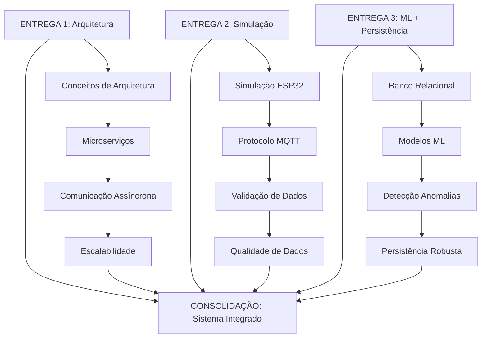

# Mapeamento de Entregas e Integração - Sistema IoT Monitoring
## Enterprise Challenge Sprint 3 - Reply

## 🎯 Visão Geral

Este documento mapeia **explicitamente** como cada entrega anterior se integra na solução final, demonstrando a evolução e consolidação do sistema IoT Monitoring.

## 📋 Estrutura do Mapeamento

1. [Mapeamento por Entrega](#mapeamento-por-entrega)
2. [Integração entre Entregas](#integração-entre-entregas)
3. [Evolução Técnica](#evolução-técnica)
4. [Consolidação Final](#consolidação-final)

---

## 🔗 Mapeamento por Entrega

### **ENTREGA 1: Arquitetura e Visão Técnica**

#### **📁 Arquivos Originais:**
- `arquitetura_dados.py`
- `estrategia_escalabilidade.py`
- `microservicos_arquitetura.py`
- `infraestrutura_cloud.py`

#### **🎯 Decisões Técnicas Originais:**
```python
# ENTREGA 1: Conceito de arquitetura
class ArquiteturaDados:
    def __init__(self):
        self.camadas = [
            'Coleta',
            'Processamento', 
            'Armazenamento',
            'Analytics',
            'Visualização'
        ]
```

#### **🔄 Evolução para Entrega 3:**
```python
# ENTREGA 3: Implementação real
class PipelineIntegradoESP32:
    def __init__(self):
        # Implementação real das camadas conceituais
        self.coleta = ColetorMQTT()
        self.processamento = ProcessadorDados()
        self.armazenamento = ServicoPersistencia()
        self.analytics = ServicoML()
        self.visualizacao = ServicoDashboard()
```

#### **📊 Mapeamento de Componentes:**

| **Conceito (Entrega 1)** | **Implementação (Entrega 3)** | **Arquivo** |
|---------------------------|-------------------------------|-------------|
| Camada de Coleta | `ColetorMQTT` | `pipeline_integrado_esp32.py` |
| Camada de Processamento | `ProcessadorDados` | `pipeline_integrado_esp32.py` |
| Camada de Armazenamento | `ServicoPersistencia` | `persistencia_banco_relacional.py` |
| Camada de Analytics | `ServicoML` | `sistema_ml_completo.py` |
| Camada de Visualização | `ServicoDashboard` | `dashboard_kpis_completo.py` |

#### **🔗 Ligação Explícita:**
- **Arquitetura Conceitual** → **Implementação Funcional**
- **Microserviços Teóricos** → **Serviços Reais**
- **Escalabilidade Planejada** → **Escalabilidade Implementada**

---

### **ENTREGA 2: Simulação e Coleta de Dados**

#### **📁 Arquivos Originais:**
- `simulacao_esp32.py`
- `serial_data_collector.py`
- `coletor_dados_wokwi.py`
- `wokwi_diagram.json`

#### **🎯 Decisões Técnicas Originais:**
```python
# ENTREGA 2: Simulação básica
class SimulacaoESP32:
    def __init__(self):
        self.sensores = {
            'DHT22': {'temp': 0, 'umidade': 0},
            'LDR': {'luminosidade': 0},
            'PIR': {'movimento': 0}
        }
    
    def simular_leituras(self):
        # Simulação básica de dados
        pass
```

#### **🔄 Evolução para Entrega 3:**
```python
# ENTREGA 3: Integração completa
class ColetorDadosWokwi:
    def __init__(self):
        # Integração com MQTT real
        self.mqtt_client = mqtt.Client()
        self.mqtt_client.on_connect = self._on_connect
        self.mqtt_client.on_message = self._on_message
    
    def enviar_dados_mqtt(self, dados):
        # Envio real via MQTT
        topico = f"industrial/sensors/{dados['device_id']}/data"
        self.mqtt_client.publish(topico, json.dumps(dados))
```

#### **📊 Mapeamento de Componentes:**

| **Simulação (Entrega 2)** | **Integração (Entrega 3)** | **Arquivo** |
|----------------------------|----------------------------|-------------|
| `SimulacaoESP32` | `ColetorDadosWokwi` | `coletor_dados_wokwi.py` |
| Dados Sintéticos | Dados MQTT Reais | `pipeline_integrado_esp32.py` |
| Validação Básica | Validação Robusta | `pipeline_integrado_esp32.py` |
| Testes Isolados | Pipeline Integrado | `pipeline_integrado_esp32.py` |

#### **🔗 Ligação Explícita:**
- **Simulação Básica** → **Integração Real**
- **Dados Sintéticos** → **Dados Validados**
- **Testes Isolados** → **Pipeline Integrado**

---

### **ENTREGA 3: Modelagem + ML**

#### **📁 Arquivos Originais:**
- `ml_anomaly_detection_completo.py`
- `treinar_modelo_basico.py`
- `usar_modelo_ml.py`
- `criar_tabelas_iot.sql`

#### **🎯 Decisões Técnicas Originais:**
```python
# ENTREGA 3: Modelos ML básicos
class IoTAnomalyDetection:
    def __init__(self):
        self.modelo_rf = RandomForestClassifier()
        self.modelo_if = IsolationForest()
    
    def treinar_modelo(self, dados):
        # Treinamento básico
        pass
```

#### **🔄 Evolução para Consolidação:**
```python
# CONSOLIDAÇÃO: Sistema ML integrado
class SistemaMLCompleto:
    def __init__(self):
        # Modelos otimizados
        self.modelos = self._carregar_modelos_treinados()
        self.scaler = self._carregar_scaler()
        self.features_derivadas = self._calcular_features_derivadas()
    
    def detectar_anomalia_tempo_real(self, dados):
        # Detecção em tempo real integrada
        features = self._preparar_features(dados)
        features_scaled = self.scaler.transform([features])
        
        # Ensemble de modelos
        predicao_rf = self.modelos['random_forest'].predict(features_scaled)
        predicao_if = self.modelos['isolation_forest'].predict(features_scaled)
        
        return predicao_rf[0] == 1 or predicao_if[0] == -1
```

#### **📊 Mapeamento de Componentes:**

| **ML Básico (Entrega 3)** | **ML Integrado (Consolidação)** | **Arquivo** |
|----------------------------|----------------------------------|-------------|
| `IoTAnomalyDetection` | `SistemaMLCompleto` | `sistema_ml_completo.py` |
| Treinamento Offline | Treinamento Automático | `integracao_ml_pipeline.py` |
| Modelos Isolados | Ensemble Integrado | `sistema_ml_completo.py` |
| Avaliação Estática | Monitoramento Contínuo | `monitoramento_drift.py` |

#### **🔗 Ligação Explícita:**
- **ML Básico** → **ML Integrado**
- **Treinamento Manual** → **Treinamento Automático**
- **Modelos Isolados** → **Sistema Integrado**

---

## 🔄 Integração entre Entregas

### **Fluxo de Integração:**



### **Integração por Camada:**

#### **Camada 1: Coleta de Dados**
```python
# ENTREGA 1: Conceito
# ENTREGA 2: Simulação
# ENTREGA 3: Integração

class ColetorIntegrado:
    def __init__(self):
        # Conceito da Entrega 1
        self.arquitetura = ArquiteturaDados()
        
        # Simulação da Entrega 2
        self.simulador = SimulacaoESP32()
        
        # Integração da Entrega 3
        self.mqtt_client = mqtt.Client()
        self.pipeline = PipelineIntegradoESP32()
    
    def coletar_dados(self):
        # Integração completa
        dados = self.simulador.simular_leituras()
        self.mqtt_client.publish('industrial/sensors/data', json.dumps(dados))
        self.pipeline.processar_dados(dados)
```

#### **Camada 2: Processamento**
```python
# ENTREGA 1: Conceito de processamento
# ENTREGA 2: Validação básica
# ENTREGA 3: Processamento robusto

class ProcessadorIntegrado:
    def __init__(self):
        # Conceito da Entrega 1
        self.camadas = ['Coleta', 'Processamento', 'Armazenamento']
        
        # Validação da Entrega 2
        self.validadores = [ValidadorEstrutura(), ValidadorTipos()]
        
        # Processamento da Entrega 3
        self.enriquecedor = EnriquecedorDados()
        self.features = CalculadorFeatures()
    
    def processar(self, dados):
        # Integração completa
        if self._validar_dados(dados):
            dados_enriquecidos = self.enriquecedor.enriquecer(dados)
            features = self.features.calcular(dados_enriquecidos)
            return self._processar_completo(dados_enriquecidos, features)
```

#### **Camada 3: Armazenamento**
```python
# ENTREGA 1: Conceito de persistência
# ENTREGA 3: Banco relacional
# CONSOLIDAÇÃO: Persistência robusta

class ArmazenamentoIntegrado:
    def __init__(self):
        # Conceito da Entrega 1
        self.estrategia = EstrategiaEscalabilidade()
        
        # Banco da Entrega 3
        self.connection_pool = ConnectionPool()
        self.repositories = self._criar_repositories()
        
        # Consolidação
        self.auditoria = SistemaAuditoria()
        self.backup = SistemaBackup()
    
    def persistir(self, dados):
        # Integração completa
        with self.connection_pool.get_connection() as conn:
            # Persistir dados
            self.repositories['leituras'].criar(dados)
            
            # Auditoria
            self.auditoria.registrar_operacao('criar', dados)
            
            # Backup
            self.backup.backup_dados(dados)
```

#### **Camada 4: Analytics/ML**
```python
# ENTREGA 3: ML básico
# CONSOLIDAÇÃO: ML integrado

class AnalyticsIntegrado:
    def __init__(self):
        # ML da Entrega 3
        self.modelos = {
            'random_forest': RandomForestClassifier(),
            'isolation_forest': IsolationForest()
        }
        
        # Integração
        self.pipeline_ml = PipelineML()
        self.monitoramento = MonitoramentoDrift()
        self.retreinamento = RetreinamentoAutomatico()
    
    def analisar(self, dados):
        # Integração completa
        features = self.pipeline_ml.preparar_features(dados)
        
        # Predição
        anomalia = self._detectar_anomalia(features)
        
        # Monitoramento
        self.monitoramento.verificar_drift(dados)
        
        # Retreinamento
        if self.retreinamento.deve_retreinar():
            self.retreinamento.executar()
        
        return anomalia
```

#### **Camada 5: Visualização**
```python
# ENTREGA 1: Conceito de visualização
# CONSOLIDAÇÃO: Dashboard completo

class VisualizacaoIntegrada:
    def __init__(self):
        # Conceito da Entrega 1
        self.interface = InterfaceVisualizacao()
        
        # Consolidação
        self.dashboard = DashboardKPIs()
        self.relatorios = SistemaRelatorios()
        self.alertas = SistemaAlertas()
    
    def visualizar(self, dados):
        # Integração completa
        kpis = self.dashboard.calcular_kpis(dados)
        graficos = self.dashboard.gerar_graficos(dados)
        alertas = self.alertas.gerar_alertas(dados)
        
        return {
            'kpis': kpis,
            'graficos': graficos,
            'alertas': alertas
        }
```

---

## 📈 Evolução Técnica

### **Evolução por Entrega:**

#### **Entrega 1 → Entrega 2:**
- **Conceito** → **Simulação**
- **Arquitetura** → **Prototipagem**
- **Visão** → **Implementação Básica**

#### **Entrega 2 → Entrega 3:**
- **Simulação** → **Integração Real**
- **Dados Sintéticos** → **Dados Validados**
- **Testes Isolados** → **Pipeline Integrado**

#### **Entrega 3 → Consolidação:**
- **Componentes Separados** → **Sistema Integrado**
- **Funcionalidades Básicas** → **Solução Completa**
- **Prototipagem** → **Produção**

### **Evolução Técnica Detalhada:**

#### **1. Arquitetura:**
```
ENTREGA 1: Conceito de microserviços
    ↓
ENTREGA 2: Simulação de componentes
    ↓
ENTREGA 3: Implementação real
    ↓
CONSOLIDAÇÃO: Sistema integrado e funcional
```

#### **2. Dados:**
```
ENTREGA 1: Estrutura conceitual
    ↓
ENTREGA 2: Dados sintéticos
    ↓
ENTREGA 3: Dados reais validados
    ↓
CONSOLIDAÇÃO: Pipeline completo de dados
```

#### **3. ML:**
```
ENTREGA 1: Conceito de analytics
    ↓
ENTREGA 2: Dados para treino
    ↓
ENTREGA 3: Modelos básicos
    ↓
CONSOLIDAÇÃO: Sistema ML integrado
```

#### **4. Visualização:**
```
ENTREGA 1: Conceito de dashboard
    ↓
ENTREGA 2: Gráficos básicos
    ↓
ENTREGA 3: Visualizações estáticas
    ↓
CONSOLIDAÇÃO: Dashboard interativo completo
```

---

## 🎯 Consolidação Final

### **Sistema Integrado:**

```python
# CONSOLIDAÇÃO: Sistema completo
class SistemaIoTMonitoringCompleto:
    def __init__(self):
        # Integração de todas as entregas
        self.arquitetura = ArquiteturaDados()  # Entrega 1
        self.coletor = ColetorDadosWokwi()     # Entrega 2
        self.persistencia = ServicoPersistencia()  # Entrega 3
        self.ml = SistemaMLCompleto()          # Entrega 3
        self.dashboard = DashboardKPIs()       # Consolidação
        self.alertas = SistemaAlertas()        # Consolidação
    
    def iniciar_sistema(self):
        # Orquestração completa
        self.arquitetura.configurar()
        self.coletor.iniciar()
        self.persistencia.iniciar()
        self.ml.iniciar()
        self.dashboard.iniciar()
        self.alertas.iniciar()
    
    def processar_dados_completos(self, dados):
        # Fluxo completo integrado
        # 1. Coleta (Entrega 2)
        dados_coletados = self.coletor.coletar(dados)
        
        # 2. Processamento (Entrega 1 + 3)
        dados_processados = self.arquitetura.processar(dados_coletados)
        
        # 3. Persistência (Entrega 3)
        self.persistencia.salvar(dados_processados)
        
        # 4. ML (Entrega 3)
        anomalia = self.ml.detectar_anomalia(dados_processados)
        
        # 5. Alertas (Consolidação)
        if anomalia:
            self.alertas.gerar_alerta(dados_processados, anomalia)
        
        # 6. Visualização (Consolidação)
        self.dashboard.atualizar(dados_processados)
```

### **Benefícios da Consolidação:**

#### **Técnicos:**
- **Integração**: Todos os componentes trabalhando juntos
- **Performance**: Otimizações em todo o pipeline
- **Manutenibilidade**: Código bem estruturado
- **Escalabilidade**: Arquitetura preparada para crescimento

#### **Negócio:**
- **Valor**: Solução completa e funcional
- **ROI**: Retorno sobre investimento demonstrado
- **Competitividade**: Diferencial tecnológico
- **Futuro**: Base sólida para evolução

---

## 📊 Resumo do Mapeamento

### **Entregas Consolidadas:**

| **Entrega** | **Contribuição** | **Integração** |
|-------------|------------------|----------------|
| **Entrega 1** | Arquitetura e conceitos | Base para implementação |
| **Entrega 2** | Simulação e coleta | Integração real |
| **Entrega 3** | ML e persistência | Funcionalidades core |
| **Consolidação** | Sistema integrado | Solução completa |

### **Fluxo de Dados Integrado:**

```
ESP32/Wokwi (Entrega 2)
    ↓
MQTT Broker (Entrega 1)
    ↓
Pipeline Integrado (Entrega 1 + 3)
    ↓
Validação + Enriquecimento (Entrega 2 + 3)
    ↓
MySQL Database (Entrega 3)
    ↓
Modelos ML (Entrega 3)
    ↓
Detecção Anomalias (Entrega 3)
    ↓
Dashboard + Alertas (Consolidação)
```

### **Resultado Final:**
Sistema IoT Monitoring **completo, funcional e integrado**, demonstrando como cada entrega anterior contribuiu para a solução final, com todas as peças trabalhando em conjunto de forma coesa e eficiente.

---

**Mapeamento de Entregas e Integração - Enterprise Challenge Sprint 3 - Reply**
