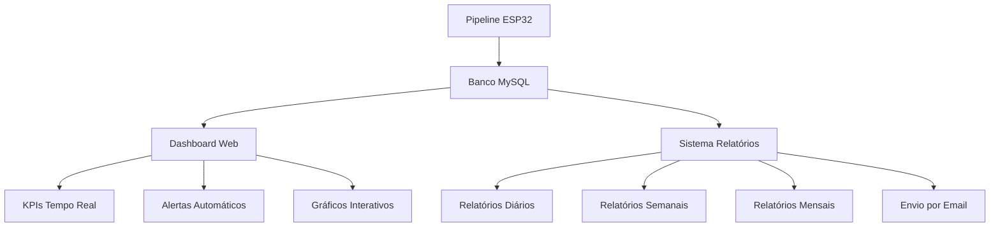

# Dashboard Completo com KPIs e Alertas
## Sistema IoT Monitoring Sprint 3 - Visualização e Relatórios

## 🎯 Visão Geral

Este sistema implementa um **dashboard completo com KPIs e alertas** baseados em thresholds e regras simples, integrando perfeitamente com o pipeline ESP32, persistência no banco e sistema de ML.

## 🏗️ Arquitetura do Dashboard



## 📊 Componentes do Sistema

### **1. Dashboard Web Interativo** (`dashboard_kpis_completo.py`)
- **Interface web** responsiva com Bootstrap
- **KPIs em tempo real** atualizados automaticamente
- **Gráficos interativos** com Plotly
- **Sistema de alertas** visual com cores por severidade
- **API REST** para integração externa

### **2. Sistema de Alertas Inteligente**
- **Thresholds configuráveis** por tipo de sensor
- **Regras simples** de detecção de anomalias
- **Classificação por severidade** (Baixa, Média, Alta, Crítica)
- **Alertas automáticos** no banco de dados
- **Notificações visuais** no dashboard

### **3. Sistema de Relatórios Automáticos** (`sistema_relatorios_automaticos.py`)
- **Relatórios diários, semanais e mensais**
- **Gráficos personalizados** com matplotlib/seaborn
- **Templates HTML** responsivos
- **Envio automático** por email
- **Agendamento flexível** com cron

### **4. Calculadora de KPIs Avançada**
- **KPIs operacionais** em tempo real
- **Métricas de qualidade** dos dados
- **Taxa de disponibilidade** dos dispositivos
- **Análise de performance** do sistema

## 🚀 Funcionalidades Implementadas

### **✅ Dashboard Web Completo**
- [x] **Interface responsiva** com Bootstrap 5
- [x] **KPIs em tempo real** com atualização automática
- [x] **Gráficos interativos** com Plotly
- [x] **Sistema de alertas** visual
- [x] **API REST** para integração

### **✅ Sistema de Alertas Inteligente**
- [x] **Thresholds configuráveis** por sensor
- [x] **Regras de detecção** automática
- [x] **Classificação por severidade**
- [x] **Alertas visuais** no dashboard
- [x] **Histórico completo** de alertas

### **✅ Relatórios Automáticos**
- [x] **Relatórios diários** com KPIs do dia
- [x] **Relatórios semanais** com tendências
- [x] **Relatórios mensais** com análises
- [x] **Gráficos personalizados** para cada período
- [x] **Envio automático** por email

### **✅ Visualizações Avançadas**
- [x] **Tendência dos sensores** ao longo do tempo
- [x] **Distribuição de alertas** por severidade
- [x] **Qualidade dos dados** por período
- [x] **Leituras por hora** do dia
- [x] **Análise de performance** do sistema

## 🛠️ Instalação e Configuração

### **1. Dependências**
```bash
pip install flask plotly matplotlib seaborn jinja2 schedule pandas numpy
```

### **2. Configuração do Sistema**
```json
{
  "dashboard": {
    "host": "0.0.0.0",
    "port": 5000,
    "debug": false,
    "update_interval": 30,
    "max_alertas_exibidos": 50
  },
  "relatorios": {
    "diretorio_relatorios": "relatorios/",
    "enviar_email": false,
    "frequencia_diario": "08:00",
    "frequencia_semanal": "monday 09:00",
    "frequencia_mensal": "1 10:00"
  }
}
```

## 🚀 Como Executar

### **1. Sistema Completo**
```bash
python executar_dashboard_completo.py --modo completo
```

### **2. Apenas Dashboard**
```bash
python executar_dashboard_completo.py --modo dashboard_apenas
```

### **3. Apenas Relatórios**
```bash
python executar_dashboard_completo.py --modo relatorios_apenas
```

### **4. Teste do Sistema**
```bash
python executar_dashboard_completo.py --modo teste
```

### **5. Status do Sistema**
```bash
python executar_dashboard_completo.py --modo status
```

### **6. Gerar Relatório Manual**
```bash
python executar_dashboard_completo.py --tipo-relatorio diario
python executar_dashboard_completo.py --tipo-relatorio semanal
python executar_dashboard_completo.py --tipo-relatorio mensal
```

## 📊 KPIs Implementados

### **KPIs Operacionais**
- **Dispositivos Ativos**: Total de dispositivos ESP32 conectados
- **Sensores Ativos**: Total de sensores funcionando
- **Leituras (24h)**: Número de leituras nas últimas 24 horas
- **Alertas Ativos**: Alertas não resolvidos no sistema
- **Disponibilidade**: Taxa de disponibilidade dos dispositivos

### **KPIs de Qualidade**
- **Qualidade Média dos Dados**: Média da qualidade das leituras
- **Taxa de Anomalias**: Proporção de anomalias detectadas
- **Alertas por Severidade**: Distribuição de alertas por nível
- **Dispositivos Offline**: Dispositivos sem comunicação recente

### **KPIs de Performance**
- **Taxa de Processamento**: Leituras processadas por segundo
- **Tempo de Resposta**: Latência das operações
- **Uso de Recursos**: CPU, memória e disco
- **Disponibilidade do Sistema**: Uptime do sistema

## 🚨 Sistema de Alertas

### **Configuração de Thresholds**
```python
regras_alertas = {
    'temperatura': {
        'minimo': 10.0,
        'maximo': 35.0,
        'critico_min': 5.0,
        'critico_max': 40.0,
        'severidade_baixa': 'media',
        'severidade_critica': 'critica'
    },
    'umidade': {
        'minimo': 30.0,
        'maximo': 80.0,
        'critico_min': 20.0,
        'critico_max': 90.0,
        'severidade_baixa': 'media',
        'severidade_critica': 'critica'
    }
}
```

### **Classificação de Severidade**
- **🔴 Crítica**: Valores extremos que requerem ação imediata
- **🟠 Alta**: Valores próximos aos limites críticos
- **🟡 Média**: Valores fora da faixa normal
- **🟢 Baixa**: Valores próximos aos limites de alerta

## 📈 Visualizações Implementadas

### **Gráficos de Tendência**
- **Leituras por Hora**: Distribuição temporal das leituras
- **Tendência dos Sensores**: Evolução dos valores ao longo do tempo
- **Qualidade dos Dados**: Distribuição da qualidade por período

### **Gráficos de Análise**
- **Alertas por Severidade**: Distribuição de alertas
- **Performance do Sistema**: Métricas de performance
- **Análise de Dispositivos**: Status e disponibilidade

### **Dashboards Especializados**
- **Dashboard Operacional**: KPIs em tempo real
- **Dashboard de Alertas**: Foco em alertas e notificações
- **Dashboard de Análise**: Gráficos e tendências

## 📋 Relatórios Automáticos

### **Relatório Diário**
- **KPIs do dia anterior**
- **Gráfico de leituras por hora**
- **Distribuição da qualidade dos dados**
- **Resumo por tipo de sensor**
- **Alertas gerados no dia**

### **Relatório Semanal**
- **Tendências da semana**
- **Análise de performance**
- **Distribuição de alertas**
- **Comparativo com semanas anteriores**

### **Relatório Mensal**
- **Análise completa do mês**
- **Métricas de disponibilidade**
- **Tendências de longo prazo**
- **Recomendações de melhoria**

## 🔧 Configurações Avançadas

### **Personalização do Dashboard**
```python
config_dashboard = ConfiguracaoDashboard(
    host="0.0.0.0",
    port=5000,
    debug=False,
    update_interval=30,  # Atualização a cada 30s
    max_alertas_exibidos=50
)
```

### **Configuração de Relatórios**
```python
config_relatorios = ConfiguracaoRelatorios(
    diretorio_relatorios="relatorios/",
    enviar_email=True,
    email_smtp="smtp.gmail.com",
    email_user="seu_email@gmail.com",
    email_password="sua_senha",
    email_destinatarios=["admin@empresa.com"],
    frequencia_diario="08:00",
    frequencia_semanal="monday 09:00"
)
```

## 🌐 Acesso ao Dashboard

### **URL do Dashboard**
```
http://localhost:5000
```

### **APIs Disponíveis**
- `GET /api/kpis` - KPIs em tempo real
- `GET /api/alertas` - Alertas ativos
- `GET /api/graficos/tendencia` - Gráfico de tendência
- `GET /api/graficos/alertas` - Gráfico de alertas
- `GET /api/graficos/qualidade` - Gráfico de qualidade
- `GET /api/status` - Status do sistema

## 📱 Interface Responsiva

### **Características da Interface**
- **Design responsivo** para desktop, tablet e mobile
- **Cores intuitivas** para diferentes tipos de alertas
- **Atualização automática** sem necessidade de refresh
- **Navegação intuitiva** com ícones e labels claros
- **Temas personalizáveis** para diferentes ambientes

### **Componentes Visuais**
- **Cards de KPIs** com gradientes e animações
- **Gráficos interativos** com zoom e hover
- **Tabelas responsivas** com ordenação
- **Alertas visuais** com cores e ícones
- **Indicadores de status** em tempo real

## 🔄 Integração com Outros Sistemas

### **Integração com Pipeline ESP32**
- **Recebimento automático** de dados MQTT
- **Processamento em tempo real** de leituras
- **Atualização automática** do dashboard
- **Sincronização** com banco de dados

### **Integração com Sistema ML**
- **Alertas baseados em ML** para anomalias
- **Métricas de performance** do modelo
- **Visualização de predições** em tempo real
- **Análise de confiança** das predições

### **Integração com Banco de Dados**
- **Consultas otimizadas** para performance
- **Cache inteligente** de dados frequentes
- **Atualização incremental** de KPIs
- **Backup automático** de configurações

## 📋 Checklist de Implementação

### **✅ Dashboard Web**
- [x] Interface responsiva com Bootstrap
- [x] KPIs em tempo real
- [x] Gráficos interativos
- [x] Sistema de alertas visual
- [x] API REST completa

### **✅ Sistema de Alertas**
- [x] Thresholds configuráveis
- [x] Regras de detecção
- [x] Classificação por severidade
- [x] Alertas automáticos
- [x] Histórico completo

### **✅ Relatórios Automáticos**
- [x] Relatórios diários/semanais/mensais
- [x] Gráficos personalizados
- [x] Templates HTML
- [x] Envio por email
- [x] Agendamento flexível

### **✅ Visualizações**
- [x] Gráficos de tendência
- [x] Análise de alertas
- [x] Qualidade dos dados
- [x] Performance do sistema
- [x] Dashboards especializados

## 🎯 Próximos Passos

1. **Implementar notificações push** para alertas críticos
2. **Adicionar exportação** de dados em Excel/PDF
3. **Criar dashboards personalizáveis** por usuário
4. **Implementar análise preditiva** com ML
5. **Adicionar integração** com sistemas externos

## 📞 Suporte

Para dúvidas ou problemas:
- **Dashboard**: Acesse `http://localhost:5000`
- **Logs**: Verifique os logs do sistema
- **Testes**: Execute `--modo teste` para validar
- **Configuração**: Verifique `config_pipeline.json`
- **Relatórios**: Verifique diretório `relatorios/`

---

**Dashboard Completo com KPIs e Alertas - Enterprise Challenge Sprint 3 - Reply**
