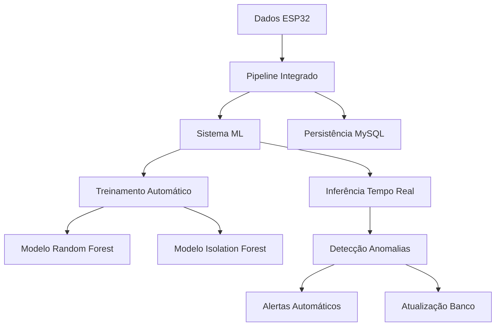

# Sistema ML Completo - Treino e Inferência
## Sistema IoT Monitoring Sprint 3 - Detecção de Anomalias

## 🎯 Visão Geral

Este sistema implementa **treino e inferência completos do modelo de ML básico** para detecção de anomalias em dados IoT, integrando perfeitamente com o pipeline ESP32 e a persistência no banco relacional.

## 🏗️ Arquitetura do Sistema ML



## 🤖 Modelos de ML Implementados

### **1. Random Forest Classifier**
- **Algoritmo**: Ensemble de árvores de decisão
- **Parâmetros**: 100 estimadores, profundidade máxima 10
- **Balanceamento**: `class_weight='balanced'` para classes desbalanceadas
- **Features**: 10 variáveis (7 originais + 3 derivadas)

### **2. Isolation Forest**
- **Algoritmo**: Detecção de anomalias não supervisionada
- **Contaminação**: 10% (proporção esperada de anomalias)
- **Vantagem**: Detecta anomalias sem necessidade de labels

### **3. Ensemble Híbrido**
- **Combinação**: Random Forest + Isolation Forest
- **Votação**: Predição final baseada em ambos os modelos
- **Confiança**: Nível de confiança baseado na concordância

## 📊 Features do Modelo

### **Features Originais**
1. **Temperature** (°C): Temperatura ambiente
2. **Humidity** (%): Umidade relativa
3. **Pressure** (bar): Pressão barométrica
4. **Vibration** (g): Magnitude da vibração
5. **Level** (cm): Nível de líquido/tanque
6. **Luminosity** (lux): Intensidade luminosa
7. **Movement** (boolean): Detecção de movimento

### **Features Derivadas**
8. **temp_humidity_ratio**: Relação temperatura/umidade
9. **pressure_vibration**: Produto pressão × vibração
10. **level_luminosity**: Relação nível/luminosidade

## 🚀 Componentes do Sistema

### **1. Sistema ML Completo** (`sistema_ml_completo.py`)
- **Treinamento automático** com dados do banco
- **Inferência em tempo real** para dados ESP32
- **Retreinamento periódico** (configurável)
- **Validação cruzada** e métricas de performance
- **Persistência de modelos** em disco

### **2. Integração ML Pipeline** (`integracao_ml_pipeline.py`)
- **Integração completa** com pipeline ESP32
- **Processamento em tempo real** de dados MQTT
- **Criação automática** de alertas baseados em ML
- **Atualização automática** do banco com resultados ML

### **3. Executador ML Completo** (`executar_ml_completo.py`)
- **Múltiplos modos** de execução
- **Testes automatizados** do sistema
- **Demonstração interativa** com dados de exemplo
- **Monitoramento** em tempo real

## 📋 Funcionalidades Implementadas

### **✅ Treinamento Automático**
- [x] **Treinamento inicial** com dados sintéticos
- [x] **Retreinamento automático** com dados reais do banco
- [x] **Validação cruzada** 5-fold
- [x] **Métricas de performance** completas
- [x] **Persistência de modelos** treinados

### **✅ Inferência em Tempo Real**
- [x] **Processamento MQTT** de dados ESP32
- [x] **Detecção de anomalias** instantânea
- [x] **Níveis de confiança** (Alta, Média, Baixa)
- [x] **Criação automática** de alertas
- [x] **Atualização do banco** com resultados

### **✅ Sistema de Alertas ML**
- [x] **Classificação por severidade** baseada em probabilidade
- [x] **Alertas automáticos** no banco de dados
- [x] **Integração com sistema** de notificações
- [x] **Histórico completo** de alertas ML

### **✅ Monitoramento e Métricas**
- [x] **Estatísticas em tempo real** do sistema
- [x] **Métricas de performance** do modelo
- [x] **Taxa de anomalias** detectadas
- [x] **Monitoramento de drift** de dados

## 🛠️ Instalação e Configuração

### **1. Dependências**
```bash
pip install scikit-learn pandas numpy joblib paho-mqtt mysql-connector-python
```

### **2. Configuração do Sistema**
```json
{
  "ml": {
    "modelo_path": "modelos/",
    "retreinar_intervalo_horas": 24,
    "threshold_anomalia": 0.5,
    "min_amostras_treino": 1000
  },
  "database": {
    "host": "localhost",
    "database": "iot_monitoring_db",
    "username": "root",
    "password": "password"
  }
}
```

## 🚀 Como Executar

### **1. Sistema Integrado Completo**
```bash
python executar_ml_completo.py --modo integrado
```

### **2. Apenas Sistema ML**
```bash
python executar_ml_completo.py --modo ml_apenas
```

### **3. Treinamento Apenas**
```bash
python executar_ml_completo.py --modo treino_apenas
```

### **4. Teste do Sistema**
```bash
python executar_ml_completo.py --modo teste
```

### **5. Demonstração Interativa**
```bash
python executar_ml_completo.py --modo demo
```

## 📊 Exemplos de Uso

### **Treinamento do Modelo**
```python
from sistema_ml_completo import SistemaMLCompleto, ConfiguracaoML

# Configuração
config_ml = ConfiguracaoML(
    modelo_path="modelos/",
    retreinar_intervalo_horas=24,
    threshold_anomalia=0.5
)

# Inicializa sistema
sistema_ml = SistemaMLCompleto(config_banco, config_ml)
sistema_ml.iniciar()

# Força retreinamento
sistema_ml.forcar_retreinamento()
```

### **Inferência de Anomalias**
```python
# Dados do sensor
dados_sensor = {
    'temperature': 25.5,
    'humidity': 60.0,
    'pressure': 1.013,
    'vibration': 0.1,
    'level': 100.0,
    'luminosity': 500.0,
    'movement': 0
}

# Faz inferência
resultado = sistema_ml.inferir_anomalia(dados_sensor)

print(f"Anomalia detectada: {resultado['anomalia_detectada']}")
print(f"Probabilidade: {resultado['probabilidade']:.4f}")
print(f"Confiança: {resultado['confianca']}")
```

### **Sistema Integrado**
```python
from integracao_ml_pipeline import IntegracaoMLPipeline

# Inicializa sistema integrado
sistema_integrado = IntegracaoMLPipeline(config_banco, config_mqtt, config_ml)
sistema_integrado.iniciar()

# Sistema processa automaticamente dados MQTT
# e faz inferência ML em tempo real
```

## 📈 Métricas de Performance

### **Métricas do Modelo**
- **Accuracy**: Precisão geral do modelo
- **Precision**: Precisão na detecção de anomalias
- **Recall**: Sensibilidade na detecção de anomalias
- **F1-Score**: Média harmônica entre precision e recall
- **AUC**: Área sob a curva ROC

### **Métricas do Sistema**
- **Inferências realizadas**: Total de predições
- **Anomalias detectadas**: Total de anomalias encontradas
- **Taxa de anomalias**: Proporção de anomalias detectadas
- **Tempo de resposta**: Latência das inferências
- **Taxa de processamento**: Inferências por segundo

## 🔧 Configurações Avançadas

### **Parâmetros do Modelo**
```python
config_ml = ConfiguracaoML(
    modelo_path="modelos/",
    retreinar_intervalo_horas=24,  # Retreina a cada 24h
    threshold_anomalia=0.5,        # Threshold para anomalias
    min_amostras_treino=1000,      # Mínimo de amostras para treinar
    features_principais=[...],     # Features customizadas
    random_state=42                # Semente para reprodutibilidade
)
```

### **Retreinamento Automático**
- **Intervalo configurável** (padrão: 24 horas)
- **Dados do banco** das últimas 24h
- **Validação automática** do novo modelo
- **Substituição automática** se performance melhorar

## 🛡️ Validação e Testes

### **Testes Automatizados**
```bash
# Teste completo do sistema
python executar_ml_completo.py --modo teste

# Demonstração com dados de exemplo
python executar_ml_completo.py --modo demo
```

### **Validação de Dados**
- **Verificação de tipos** de dados
- **Validação de faixas** de valores
- **Tratamento de valores** nulos/infinitos
- **Normalização automática** de features

## 📊 Monitoramento em Tempo Real

### **Dashboard de Métricas**
- **Status do modelo**: Treinado/Não treinado
- **Performance atual**: Métricas em tempo real
- **Taxa de anomalias**: Proporção de anomalias detectadas
- **Fila de processamento**: Dados aguardando inferência

### **Alertas de Sistema**
- **Modelo não treinado**: Alerta se modelo não estiver disponível
- **Performance baixa**: Alerta se métricas caírem
- **Dados insuficientes**: Alerta se não houver dados para treinar
- **Erro de inferência**: Alerta se houver falhas na predição

## 🔄 Fluxo de Dados Completo

```
1. ESP32 coleta dados dos sensores
2. Dados enviados via MQTT
3. Pipeline recebe e valida dados
4. Sistema ML faz inferência
5. Resultado armazenado no banco
6. Alertas criados se necessário
7. Dashboard atualizado em tempo real
```

## 📋 Checklist de Implementação

### **✅ Sistema ML Básico**
- [x] Random Forest Classifier
- [x] Isolation Forest
- [x] Ensemble híbrido
- [x] Features originais e derivadas
- [x] Normalização de dados

### **✅ Treinamento Automático**
- [x] Treinamento inicial com dados sintéticos
- [x] Retreinamento com dados reais
- [x] Validação cruzada
- [x] Persistência de modelos
- [x] Métricas de performance

### **✅ Inferência Tempo Real**
- [x] Processamento MQTT
- [x] Detecção instantânea
- [x] Níveis de confiança
- [x] Criação de alertas
- [x] Atualização do banco

### **✅ Integração Completa**
- [x] Pipeline ESP32
- [x] Persistência MySQL
- [x] Sistema de alertas
- [x] Monitoramento
- [x] Testes automatizados

## 🎯 Próximos Passos

1. **Implementar modelos mais avançados** (LSTM, Autoencoder)
2. **Adicionar detecção de drift** de dados
3. **Criar dashboard web** para visualização
4. **Implementar A/B testing** de modelos
5. **Adicionar explicações** de predições (XAI)

## 📞 Suporte

Para dúvidas ou problemas:
- **Logs**: Verifique os logs do sistema
- **Testes**: Execute `--modo teste` para validar
- **Configuração**: Verifique `config_pipeline.json`
- **Modelos**: Verifique diretório `modelos/`

---

**Sistema ML Completo - Enterprise Challenge Sprint 3 - Reply**

