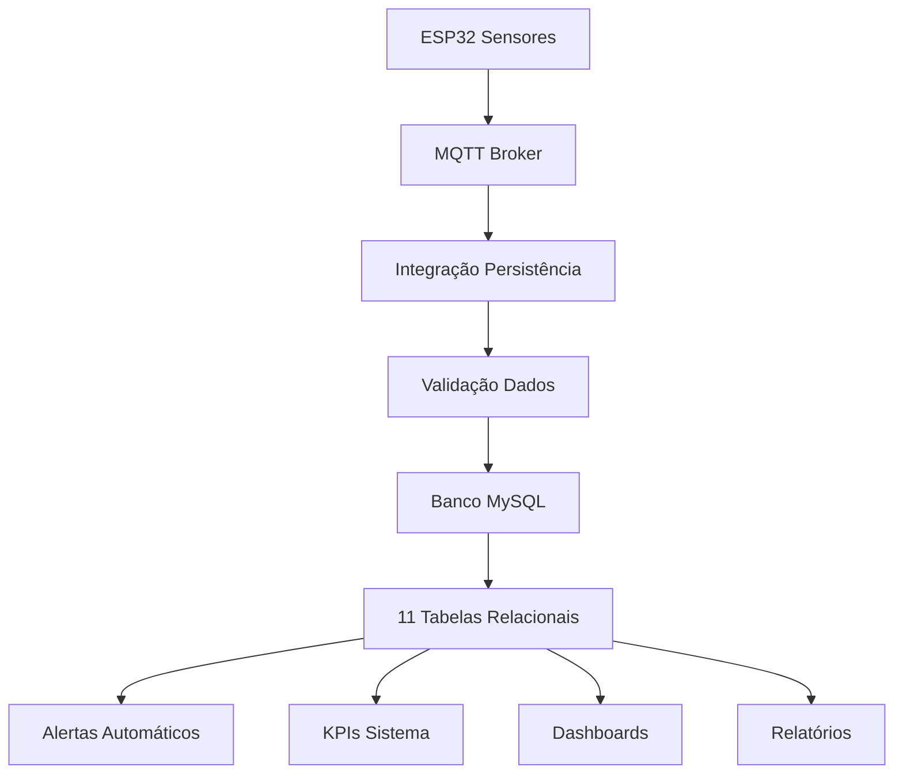

# Sistema de Persistência no Banco Relacional - IoT Monitoring Sprint 3

## 🎯 Visão Geral

Este sistema implementa **persistência completa no banco relacional modelado** com 11 tabelas, integrando coleta de dados ESP32, processamento ML e armazenamento estruturado.

## 🏗️ Arquitetura da Persistência



## 📊 Modelo de Dados (11 Tabelas)

### **Tabelas Principais**
1. **`dispositivos`** - Dispositivos ESP32 conectados
2. **`tipos_sensor`** - Catálogo de tipos de sensores
3. **`sensores`** - Sensores instalados nos dispositivos
4. **`leituras_sensores`** - Dados coletados (tabela principal)
5. **`modos_operacao`** - Estados de operação do sistema

### **Tabelas de Controle**
6. **`alertas`** - Sistema de alertas e notificações
7. **`configuracoes_limites`** - Limites para alertas
8. **`usuarios`** - Usuários do sistema
9. **`logs_sistema`** - Log de atividades

### **Tabelas de Interface**
10. **`dashboards`** - Configurações de dashboards
11. **`relatorios`** - Relatórios automáticos

## 🚀 Componentes do Sistema

### **1. Persistência Banco Relacional** (`persistencia_banco_relacional.py`)
- **Pool de conexões** MySQL otimizado
- **Operações CRUD** completas para todas as tabelas
- **Validação de dados** e integridade referencial
- **Sistema de logs** de auditoria
- **Otimizações de performance** com índices

### **2. Integração ESP32** (`integracao_persistencia_esp32.py`)
- **Recebimento MQTT** de dados ESP32
- **Cache inteligente** de dispositivos e sensores
- **Processamento em lote** para alta performance
- **Detecção automática** de anomalias
- **Criação automática** de alertas

### **3. Executador Completo** (`executar_persistencia_completa.py`)
- **Sistema completo** integrado
- **Monitoramento** em tempo real
- **Limpeza automática** de dados antigos
- **Estatísticas** detalhadas
- **Testes** automatizados

## 📋 Funcionalidades Implementadas

### **✅ Persistência de Dados**
- [x] Inserção de dispositivos ESP32
- [x] Cadastro de sensores por dispositivo
- [x] Armazenamento de leituras em tempo real
- [x] Sistema de alertas automático
- [x] Configuração de limites por sensor

### **✅ Operações CRUD Completas**
- [x] Create, Read, Update, Delete para todas as tabelas
- [x] Validação de integridade referencial
- [x] Transações seguras com rollback
- [x] Logs de auditoria completos

### **✅ Performance e Escalabilidade**
- [x] Pool de conexões MySQL
- [x] Índices otimizados para consultas
- [x] Particionamento de dados por ano
- [x] Processamento em lote
- [x] Cache inteligente

### **✅ Monitoramento e Observabilidade**
- [x] KPIs do sistema em tempo real
- [x] Estatísticas de performance
- [x] Alertas automáticos
- [x] Logs estruturados
- [x] Métricas de qualidade dos dados

## 🛠️ Instalação e Configuração

### **1. Dependências**
```bash
pip install mysql-connector-python paho-mqtt pandas numpy
```

### **2. Configuração do Banco**
```sql
-- Execute o script de criação
mysql -u root -p < criar_tabelas_iot.sql
```

### **3. Configuração do Sistema**
```json
{
  "database": {
    "host": "localhost",
    "port": 3306,
    "database": "iot_monitoring_db",
    "username": "root",
    "password": "password"
  },
  "mqtt": {
    "broker": "broker.hivemq.com",
    "port": 1883,
    "topic": "industrial/sensors/data"
  }
}
```

## 🚀 Como Executar

### **1. Teste de Persistência**
```bash
python executar_persistencia_completa.py --teste
```

### **2. Sistema Completo**
```bash
python executar_persistencia_completa.py --modo desenvolvimento
```

### **3. Modo Produção**
```bash
python executar_persistencia_completa.py --modo producao
```

## 📊 Exemplos de Uso

### **Inserir Dispositivo**
```python
from persistencia_banco_relacional import PersistenciaBancoRelacional, ConfiguracaoBanco

# Configuração
config = ConfiguracaoBanco(host="localhost", database="iot_monitoring_db")
persistencia = PersistenciaBancoRelacional(config)

# Inserir dispositivo
dispositivo = {
    'nome': 'ESP32-Sala-01',
    'mac_address': 'AA:BB:CC:DD:EE:FF',
    'ip_address': '192.168.1.100',
    'localizacao': 'Sala de Controle',
    'versao_firmware': 'v1.2.3'
}

id_dispositivo = persistencia.inserir_dispositivo(dispositivo)
```

### **Inserir Leitura de Sensor**
```python
# Inserir leitura
leitura = {
    'id_sensor': 1,
    'timestamp_unix': time.time(),
    'valor_numerico': 25.5,
    'qualidade_dados': 'bom'
}

id_leitura = persistencia.inserir_leitura_sensor(leitura)
```

### **Obter KPIs do Sistema**
```python
# Obter estatísticas
kpis = persistencia.obter_kpis_sistema()
print(f"Dispositivos ativos: {kpis['total_dispositivos']}")
print(f"Leituras (24h): {kpis['leituras_24h']}")
print(f"Alertas ativos: {kpis['alertas_ativos']}")
```

## 🔧 Configurações Avançadas

### **Limites de Sensores**
```python
# Configurar limites para alertas
limites = [
    {
        'tipo_limite': 'maximo',
        'valor_limite': 30.0,
        'severidade': 'alta'
    },
    {
        'tipo_limite': 'minimo',
        'valor_limite': 10.0,
        'severidade': 'media'
    }
]

persistencia.configurar_limites_sensor(id_sensor, limites)
```

### **Consultas Personalizadas**
```python
# Obter leituras com filtros
leituras = persistencia.obter_leituras_sensor(
    id_sensor=1,
    limite=100,
    data_inicio=datetime.now() - timedelta(hours=1),
    data_fim=datetime.now()
)
```

## 📈 Monitoramento e Métricas

### **Estatísticas em Tempo Real**
- **Leituras recebidas/processadas** por segundo
- **Taxa de erro** de processamento
- **Alertas criados** automaticamente
- **Dispositivos online/offline**
- **Qualidade dos dados** coletados

### **KPIs do Banco**
- **Total de dispositivos** ativos
- **Total de sensores** funcionando
- **Leituras nas últimas 24h**
- **Alertas ativos** no sistema
- **Dispositivos offline** (sem comunicação)

## 🛡️ Segurança e Integridade

### **Validação de Dados**
- **Verificação de tipos** de dados
- **Validação de faixas** de valores
- **Integridade referencial** automática
- **Sanitização** de entradas

### **Logs de Auditoria**
- **Todas as operações** são logadas
- **Dados anteriores/novos** armazenados
- **Timestamp** e usuário responsável
- **Rastreabilidade** completa

## 🔄 Manutenção Automática

### **Limpeza de Dados**
- **Remoção automática** de dados antigos
- **Configurável** por período
- **Otimização** do banco após limpeza
- **Preservação** de dados importantes

### **Otimização de Performance**
- **Índices** otimizados para consultas
- **Particionamento** de dados por ano
- **Pool de conexões** eficiente
- **Cache** inteligente de dados

## 📋 Checklist de Implementação

### **✅ Persistência Completa**
- [x] 11 tabelas implementadas
- [x] Relacionamentos configurados
- [x] Índices de performance
- [x] Triggers automáticos
- [x] Views para consultas

### **✅ Integração ESP32**
- [x] Recebimento MQTT
- [x] Processamento em tempo real
- [x] Cache de dispositivos
- [x] Validação de dados
- [x] Detecção de anomalias

### **✅ Sistema de Alertas**
- [x] Configuração de limites
- [x] Criação automática
- [x] Classificação por severidade
- [x] Resolução manual
- [x] Histórico completo

### **✅ Monitoramento**
- [x] KPIs em tempo real
- [x] Estatísticas de performance
- [x] Logs estruturados
- [x] Métricas de qualidade
- [x] Alertas de sistema

## 🎯 Próximos Passos

1. **Implementar dashboard** web para visualização
2. **Adicionar notificações** por email/SMS
3. **Criar relatórios** automáticos
4. **Implementar backup** automático
5. **Adicionar autenticação** de usuários

## 📞 Suporte

Para dúvidas ou problemas:
- **Logs**: Verifique os logs do sistema
- **Testes**: Execute `--teste` para validar
- **Configuração**: Verifique `config_pipeline.json`
- **Banco**: Execute `criar_tabelas_iot.sql`

---

**Sistema de Persistência no Banco Relacional - Enterprise Challenge Sprint 3 - Reply**

