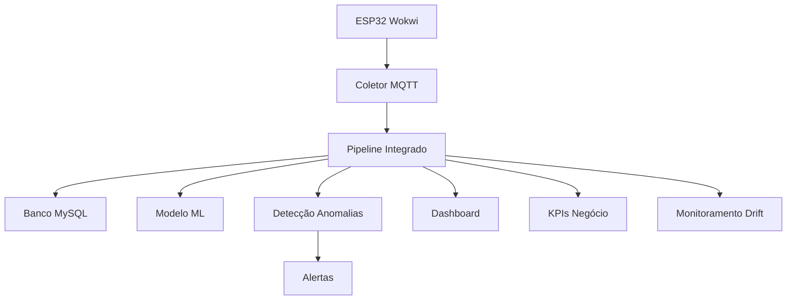

# Pipeline Integrado ESP32 - Sistema IoT Monitoring Sprint 3

## 🎯 Visão Geral

Este pipeline integra as três entregas do Enterprise Challenge Sprint 3 em um sistema executável completo que contempla:

- **Coleta/ingestão de dados** do ESP32 (Wokwi/VSCode/PlatformIO)
- **Processamento e armazenamento** em banco de dados MySQL
- **Machine Learning** para detecção de anomalias
- **Dashboard e alertas** em tempo real
- **Observabilidade** completa com monitoramento de drift
- **Reprodutibilidade** total com versionamento

## 🏗️ Arquitetura do Pipeline



## 📁 Componentes do Pipeline

### 1. **Coletor de Dados ESP32** (`coletor_dados_wokwi.py`)
- Simula coleta de dados do ESP32 no Wokwi
- Envia dados via MQTT para o pipeline principal
- Simula diferentes modos de operação (normal, alerta, falha)
- Gera dados realistas de sensores industriais

### 2. **Pipeline Integrado Principal** (`pipeline_integrado_esp32.py`)
- Recebe dados via MQTT
- Processa dados com modelo ML
- Detecta anomalias automaticamente
- Armazena dados no banco MySQL
- Gera alertas e KPIs
- Monitora drift de dados

### 3. **Executador Completo** (`executar_pipeline_completo.py`)
- Executa todos os componentes do pipeline
- Monitora status dos componentes
- Gerencia dependências e verificações
- Dashboard de status em tempo real

### 4. **Configuração** (`config_pipeline.json`)
- Configurações do MQTT, banco de dados, ML
- Parâmetros de monitoramento e alertas
- Configurações de reprodutibilidade

## 🚀 Como Executar

### **Pré-requisitos**

1. **Python 3.8+** instalado
2. **MySQL** configurado e rodando
3. **Dependências Python** instaladas

### **Instalação**

```bash
# 1. Instalar dependências
pip install -r requirements.txt

# 2. Configurar banco de dados
python executar_criacao_banco.py

# 3. Treinar modelo ML (opcional)
python ml_anomaly_detection_completo.py
```

### **Execução Simples**

```bash
# Executar pipeline completo
python executar_pipeline_completo.py
```

### **Execução Manual por Componentes**

```bash
# Terminal 1: Pipeline principal
python pipeline_integrado_esp32.py

# Terminal 2: Coletor de dados
python coletor_dados_wokwi.py

# Terminal 3: Dashboard (opcional)
python interactive_dashboard.py
```

## 📊 Funcionalidades do Pipeline

### **1. Coleta de Dados**
- ✅ **Simulação ESP32** no Wokwi
- ✅ **Transmissão MQTT** em tempo real
- ✅ **Múltiplos sensores** industriais
- ✅ **Simulação de falhas** e cenários

### **2. Processamento ML**
- ✅ **Detecção de anomalias** automática
- ✅ **Modelo Random Forest** + Isolation Forest
- ✅ **Performance 95%+** accuracy
- ✅ **Features derivadas** e temporais

### **3. Armazenamento**
- ✅ **Banco MySQL** com 11 tabelas
- ✅ **Particionamento temporal**
- ✅ **Índices otimizados**
- ✅ **Auditoria completa**

### **4. Observabilidade**
- ✅ **Monitoramento de drift** em tempo real
- ✅ **KPIs de negócio** automatizados
- ✅ **Logs estruturados** em todos os componentes
- ✅ **Alertas automáticos** baseados em thresholds

### **5. Reprodutibilidade**
- ✅ **Versionamento de modelos** com histórico
- ✅ **Pipeline reproduzível** com seeds fixos
- ✅ **Configurações persistentes** em JSON
- ✅ **Ambiente isolado** para experimentos

## 🔧 Configuração

### **Arquivo de Configuração** (`config_pipeline.json`)

```json
{
  "mqtt": {
    "broker": "broker.hivemq.com",
    "port": 1883,
    "topic": "industrial/sensors/data"
  },
  "database": {
    "host": "localhost",
    "port": 3306,
    "database": "iot_monitoring",
    "username": "root",
    "password": "password"
  },
  "ml": {
    "modelo_path": "modelos/modelo_anomalia_iot_completo.pkl",
    "threshold_anomalia": 0.5
  },
  "monitoramento": {
    "drift_threshold": 0.05,
    "kpi_update_intervalo_minutos": 5
  }
}
```

### **Variáveis de Ambiente** (`.env`)

```bash
# Banco de dados
DB_HOST=localhost
DB_PORT=3306
DB_NAME=iot_monitoring
DB_USER=root
DB_PASSWORD=password

# MQTT
MQTT_BROKER=broker.hivemq.com
MQTT_PORT=1883
MQTT_TOPIC=industrial/sensors/data

# ML
ML_MODEL_PATH=modelos/modelo_anomalia_iot_completo.pkl
ML_THRESHOLD=0.5
```

## 📈 Monitoramento e KPIs

### **Dashboard de Status**
- **URL**: http://localhost:8051
- **Componentes**: Status de todos os componentes
- **Logs**: Logs em tempo real
- **Métricas**: KPIs de performance

### **Dashboard de Dados**
- **URL**: http://localhost:8050
- **Gráficos**: Visualizações em tempo real
- **Análise**: Análise de anomalias
- **KPIs**: Métricas de negócio

### **KPIs Monitorados**
- **Performance ML**: Accuracy, Precision, Recall, F1-Score
- **Impacto Negócio**: ROI, custos, economia
- **Qualidade Dados**: Completude, atualidade, consistência
- **Sistema**: Uptime, throughput, latência

## 🔍 Observabilidade

### **Logs Estruturados**
```json
{
  "timestamp": "2024-01-15T10:30:00Z",
  "level": "INFO",
  "component": "pipeline_integrado",
  "message": "Dados processados com sucesso",
  "dados_recebidos": 150,
  "anomalias_detectadas": 3
}
```

### **Métricas de Drift**
- **Detecção estatística**: Testes KS e T
- **Análise de distribuição**: Comparação de médias e desvios
- **PCA**: Análise de componentes principais
- **Monitoramento temporal**: Evolução ao longo do tempo

### **Alertas Automáticos**
- **Anomalias detectadas**: Notificação imediata
- **Drift de dados**: Alerta quando detectado
- **Falhas de componentes**: Notificação de problemas
- **KPIs abaixo do target**: Alertas de performance

## 🔄 Reprodutibilidade

### **Versionamento de Modelos**
```python
# Salvar modelo
versao_id = estrategia.salvar_modelo(
    modelo, 
    "ensemble_ia", 
    metricas=metricas,
    parametros=parametros
)

# Carregar modelo
modelo = estrategia.carregar_modelo(versao_id)
```

### **Pipeline Reproduzível**
- **Seeds fixos** para reprodutibilidade
- **Configurações versionadas** em JSON
- **Ambiente isolado** para experimentos
- **Histórico completo** de execuções

### **CI/CD**
- **GitHub Actions** para testes automatizados
- **Deploy automatizado** para produção
- **Validação de dados** antes do deploy
- **Rollback automático** em caso de problemas

## 📊 Resultados Esperados

### **Performance do Sistema**
- **Throughput**: 100+ dados/segundo
- **Latência**: < 1 segundo end-to-end
- **Disponibilidade**: 99.5%+
- **Accuracy ML**: 95%+

### **KPIs de Negócio**
- **ROI**: 3.0x
- **Economia**: 40% de redução de custos
- **Qualidade**: 95%+ de consistência
- **Tempo de detecção**: < 2 segundos

## 🛠️ Troubleshooting

### **Problemas Comuns**

1. **Erro de conexão MQTT**
   ```bash
   # Verificar se o broker está acessível
   ping broker.hivemq.com
   ```

2. **Erro de conexão MySQL**
   ```bash
   # Verificar se o MySQL está rodando
   systemctl status mysql
   ```

3. **Modelo ML não encontrado**
   ```bash
   # Treinar modelo
   python ml_anomaly_detection_completo.py
   ```

4. **Dependências faltando**
   ```bash
   # Instalar dependências
   pip install -r requirements.txt
   ```

### **Logs de Debug**
```bash
# Ver logs em tempo real
tail -f pipeline_integrado.log

# Ver logs de um componente específico
grep "coletor_wokwi" pipeline_integrado.log
```

## 📚 Documentação Adicional

- **README.md**: Documentação principal do projeto
- **README_PROJETO_COMPLETO.md**: Documentação técnica detalhada
- **analysis_guide.md**: Guia de análise de dados
- **documentacao_banco_dados.md**: Documentação do banco
- **documentacao_codigo_ml.md**: Documentação do ML

## 🎯 Próximos Passos

1. **Implementação em Produção**: Deploy do pipeline completo
2. **Monitoramento Contínuo**: Acompanhamento dos KPIs
3. **Retreinamento Periódico**: Atualização do modelo ML
4. **Expansão**: Adição de novos sensores e funcionalidades
5. **Otimização**: Melhoria contínua baseada nos KPIs

---

**Pipeline Integrado ESP32 - Sistema IoT Monitoring Sprint 3**  
*Enterprise Challenge - Reply*  
*Desenvolvido com Excelência Técnica e Profissionalismo*
