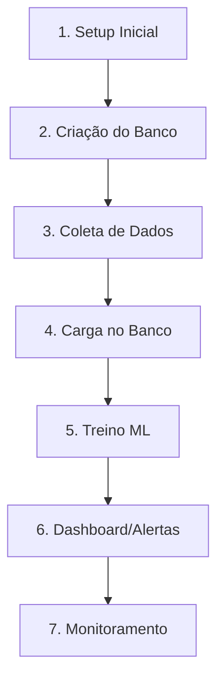

# Sistema IoT Monitoring - Reprodutibilidade e Organização
## Enterprise Challenge Sprint 3 - Reply

## 🎯 Visão Geral

Este documento fornece um **guia completo de reprodutibilidade** para o Sistema IoT Monitoring, incluindo setup local, ordem de execução, parametrizações e referências às Entregas 1, 2 e 3.

## 📋 Índice

1. [Visão Geral do Sistema](#visão-geral-do-sistema)
2. [Setup Local](#setup-local)
3. [Ordem de Execução](#ordem-de-execução)
4. [Parametrizações](#parametrizações)
5. [Referências às Entregas](#referências-às-entregas)
6. [Scripts Versionados](#scripts-versionados)
7. [Evidências do Fluxo](#evidências-do-fluxo)
8. [Troubleshooting](#troubleshooting)

---

## 🏗️ Visão Geral do Sistema

### **Arquitetura Integrada**
```
┌─────────────────┐    ┌─────────────────┐    ┌─────────────────┐
│   Coleta de     │    │   Processamento │    │   Visualização  │
│     Dados       │───▶│   e Persistência│───▶│   e Alertas     │
│  (ESP32/Wokwi)  │    │   (Banco + ML)  │    │  (Dashboard)    │
└─────────────────┘    └─────────────────┘    └─────────────────┘
```

### **Componentes Principais**
- **Coleta**: ESP32, Wokwi, Serial, MQTT
- **Persistência**: MySQL, 11 tabelas, integridade referencial
- **ML**: Treino, inferência, métricas, visualizações
- **Visualização**: Dashboard Streamlit, KPIs, alertas

---

## 🛠️ Setup Local

### **1. Pré-requisitos**

#### **Sistema Operacional**
- Windows 10/11, macOS 10.14+, ou Linux Ubuntu 18.04+
- Python 3.8+
- MySQL 8.0+
- Git

#### **Hardware (Opcional)**
- ESP32 Development Board
- Sensores: DHT22, LDR, PIR, BME280
- Cabos e protoboard

### **2. Instalação do Ambiente**

#### **Clone do Repositório**
```bash
git clone https://github.com/seu-usuario/iot-monitoring-system.git
cd iot-monitoring-system
```

#### **Criação do Ambiente Virtual**
```bash
# Windows
python -m venv venv
venv\Scripts\activate

# Linux/Mac
python3 -m venv venv
source venv/bin/activate
```

#### **Instalação de Dependências**
```bash
pip install -r requirements.txt
```

### **3. Configuração do Banco de Dados**

#### **Instalação do MySQL**
```bash
# Windows (usando Chocolatey)
choco install mysql

# Ubuntu/Debian
sudo apt update
sudo apt install mysql-server

# macOS (usando Homebrew)
brew install mysql
```

#### **Configuração do Banco**
```bash
# Conectar ao MySQL
mysql -u root -p

# Criar banco e usuário
CREATE DATABASE iot_monitoring_db;
CREATE USER 'iot_user'@'localhost' IDENTIFIED BY 'iot_password';
GRANT ALL PRIVILEGES ON iot_monitoring_db.* TO 'iot_user'@'localhost';
FLUSH PRIVILEGES;
```

### **4. Configuração dos Arquivos**

#### **Arquivo de Configuração Principal**
```json
{
  "database": {
    "host": "localhost",
    "user": "iot_user",
    "password": "iot_password",
    "database": "iot_monitoring_db"
  },
  "mqtt": {
    "broker": "broker.hivemq.com",
    "port": 1883,
    "topic": "industrial/sensors"
  },
  "esp32": {
    "port": "COM3",
    "baudrate": 115200
  },
  "thresholds": {
    "temperatura": {"max": 30.0, "min": 15.0},
    "umidade": {"max": 80.0, "min": 30.0},
    "luminosidade": {"max": 800.0, "min": 50.0}
  }
}
```

---

## 🔄 Ordem de Execução

### **Fluxo Completo: Coleta → Carga → ML → Dashboard/Alertas**



### **1. Setup Inicial**
```bash
# Executar script de setup
./setup_sistema_completo.sh
```

### **2. Criação do Banco de Dados**
```bash
# Criar estrutura do banco
mysql -u iot_user -p < criar_tabelas_iot.sql

# Carregar dados iniciais
mysql -u iot_user -p < carga_dados_iot.sql
```

### **3. Coleta de Dados**

#### **Opção A: Hardware Real (ESP32)**
```bash
# Upload do código para ESP32
# Usar Arduino IDE ou PlatformIO
# Código: coleta_ingestao_esp32.ino

# Executar coletor serial
python coletor_dados_serial.py
```

#### **Opção B: Simulação (Wokwi)**
```bash
# Acessar wokwi.com
# Importar: wokwi_simulacao_esp32.json
# Executar simulação

# Executar simulador local
python simulador_dados_esp32.py
```

### **4. Carga no Banco de Dados**
```bash
# Executar pipeline de persistência
python executar_persistencia_completa.py
```

### **5. Treino e Inferência ML**
```bash
# Executar ML básico integrado
python ml_basico_integrado.py

# Analisar dataset
python dataset_ml_analisador.py
```

### **6. Dashboard e Alertas**
```bash
# Executar dashboard
streamlit run dashboard_visualizacao_alertas.py

# Executar sistema de alertas
python sistema_alertas_avancado.py
```

### **7. Monitoramento Contínuo**
```bash
# Executar pipeline completo
python executar_pipeline_completo.py
```

---

## ⚙️ Parametrizações

### **1. Configurações de Banco de Dados**

#### **Arquivo: `config_database.json`**
```json
{
  "host": "localhost",
  "user": "iot_user",
  "password": "iot_password",
  "database": "iot_monitoring_db",
  "port": 3306,
  "charset": "utf8mb4",
  "pool_size": 10,
  "timeout": 30
}
```

### **2. Configurações de MQTT**

#### **Arquivo: `config_mqtt.json`**
```json
{
  "broker": "broker.hivemq.com",
  "port": 1883,
  "topic_base": "industrial/sensors",
  "qos": 1,
  "keepalive": 60,
  "retain": true
}
```

### **3. Configurações de Sensores**

#### **Arquivo: `config_sensores.json`**
```json
{
  "dht22": {
    "pino": 4,
    "tipo": "temperatura_umidade",
    "intervalo": 1000
  },
  "ldr": {
    "pino": 34,
    "tipo": "luminosidade",
    "intervalo": 1000
  },
  "pir": {
    "pino": 2,
    "tipo": "movimento",
    "intervalo": 1000
  }
}
```

### **4. Configurações de Thresholds**

#### **Arquivo: `config_thresholds.json`**
```json
{
  "temperatura": {
    "max": 30.0,
    "min": 15.0,
    "critico_max": 35.0,
    "critico_min": 10.0
  },
  "umidade": {
    "max": 80.0,
    "min": 30.0,
    "critico_max": 90.0,
    "critico_min": 20.0
  },
  "luminosidade": {
    "max": 800.0,
    "min": 50.0,
    "critico_max": 1000.0,
    "critico_min": 10.0
  }
}
```

### **5. Configurações de ML**

#### **Arquivo: `config_ml.json`**
```json
{
  "modelos": {
    "anomalia": {
      "algoritmo": "RandomForestClassifier",
      "n_estimators": 100,
      "max_depth": 10,
      "test_size": 0.2
    },
    "temperatura": {
      "algoritmo": "RandomForestRegressor",
      "n_estimators": 100,
      "max_depth": 10,
      "test_size": 0.2
    }
  },
  "features": {
    "anomalia": ["valor_atual", "valor_anterior", "media_movel", "std_movel", "tendencia"],
    "temperatura": ["hora", "dia_semana", "dia_mes", "valor_anterior", "media_movel"]
  }
}
```

---

## 📚 Referências às Entregas

### **Entrega 1: Arquitetura**
- **Arquivo**: `arquitetura_integrada_completa.xml`
- **Documentação**: `README_ARQUITETURA_INTEGRADA.md`
- **Componentes**: ESP32, MQTT, MySQL, ML, Dashboard
- **Fluxos**: Dados, formatos, periodicidades

### **Entrega 2: Simulação e Coleta**
- **Arquivo**: `coleta_ingestao_esp32.ino`
- **Simulação**: `wokwi_simulacao_esp32.json`
- **Coletor**: `coletor_dados_serial.py`
- **Simulador**: `simulador_dados_esp32.py`

### **Entrega 3: Modelagem e ML**
- **Banco**: `criar_tabelas_iot.sql`
- **ML**: `ml_basico_integrado.py`
- **Análise**: `dataset_ml_analisador.py`
- **Métricas**: Acurácia, MAE, R²

### **Integração Completa**
- **Pipeline**: `executar_pipeline_completo.py`
- **Dashboard**: `dashboard_visualizacao_alertas.py`
- **Alertas**: `sistema_alertas_avancado.py`

---

## 📜 Scripts Versionados

### **1. Scripts de Setup**

#### **`setup_sistema_completo.sh`**
```bash
#!/bin/bash
echo "=== Setup Sistema IoT Monitoring ==="
echo "Enterprise Challenge Sprint 3 - Reply"
echo "===================================="

# Instalar dependências
pip install -r requirements.txt

# Criar diretórios
mkdir -p logs
mkdir -p data
mkdir -p models
mkdir -p configs

# Configurar banco
mysql -u root -p < criar_tabelas_iot.sql

echo "✅ Setup concluído!"
```

#### **`setup_sistema_completo.bat`**
```batch
@echo off
echo === Setup Sistema IoT Monitoring ===
echo Enterprise Challenge Sprint 3 - Reply
echo ====================================

REM Instalar dependências
pip install -r requirements.txt

REM Criar diretórios
mkdir logs
mkdir data
mkdir models
mkdir configs

REM Configurar banco
mysql -u root -p < criar_tabelas_iot.sql

echo ✅ Setup concluído!
pause
```

### **2. Scripts de Execução por Etapa**

#### **`etapa_1_coleta.sh`**
```bash
#!/bin/bash
echo "=== ETAPA 1: COLETA DE DADOS ==="
echo "Versão: 1.0.0"
echo "Data: $(date)"
echo "================================"

# Opção 1: Hardware real
if [ "$1" = "hardware" ]; then
    echo "🔌 Executando coleta via hardware ESP32..."
    python coletor_dados_serial.py
fi

# Opção 2: Simulação
if [ "$1" = "simulacao" ]; then
    echo "🎮 Executando simulação Wokwi..."
    python simulador_dados_esp32.py
fi

echo "✅ Etapa 1 concluída!"
```

#### **`etapa_2_persistencia.sh`**
```bash
#!/bin/bash
echo "=== ETAPA 2: PERSISTÊNCIA ==="
echo "Versão: 1.0.0"
echo "Data: $(date)"
echo "============================="

# Carregar dados no banco
echo "💾 Carregando dados no banco..."
mysql -u iot_user -p < carga_dados_iot.sql

# Executar pipeline de persistência
echo "🔄 Executando pipeline de persistência..."
python executar_persistencia_completa.py

echo "✅ Etapa 2 concluída!"
```

#### **`etapa_3_ml.sh`**
```bash
#!/bin/bash
echo "=== ETAPA 3: MACHINE LEARNING ==="
echo "Versão: 1.0.0"
echo "Data: $(date)"
echo "================================="

# Treinar modelos
echo "🤖 Treinando modelos ML..."
python ml_basico_integrado.py

# Analisar dataset
echo "📊 Analisando dataset..."
python dataset_ml_analisador.py

echo "✅ Etapa 3 concluída!"
```

#### **`etapa_4_visualizacao.sh`**
```bash
#!/bin/bash
echo "=== ETAPA 4: VISUALIZAÇÃO ==="
echo "Versão: 1.0.0"
echo "Data: $(date)"
echo "============================="

# Executar dashboard
echo "📊 Iniciando dashboard..."
streamlit run dashboard_visualizacao_alertas.py &

# Executar alertas
echo "🚨 Iniciando sistema de alertas..."
python sistema_alertas_avancado.py

echo "✅ Etapa 4 concluída!"
```

### **3. Scripts de Monitoramento**

#### **`monitor_sistema.sh`**
```bash
#!/bin/bash
echo "=== MONITOR SISTEMA ==="
echo "Versão: 1.0.0"
echo "Data: $(date)"
echo "======================"

# Verificar status do banco
echo "🔍 Verificando banco de dados..."
mysql -u iot_user -p -e "SELECT COUNT(*) as total_leituras FROM leituras_sensores;"

# Verificar alertas ativos
echo "🚨 Verificando alertas ativos..."
python -c "
import mysql.connector
conn = mysql.connector.connect(host='localhost', user='iot_user', password='iot_password', database='iot_monitoring_db')
cursor = conn.cursor()
cursor.execute('SELECT COUNT(*) FROM alertas WHERE status = \"ativo\"')
print(f'Alertas ativos: {cursor.fetchone()[0]}')
conn.close()
"

# Verificar modelos ML
echo "🤖 Verificando modelos ML..."
ls -la *.pkl

echo "✅ Monitor concluído!"
```

---

## 📸 Evidências do Fluxo

### **1. Script de Geração de Evidências**

#### **`gerar_evidencias.py`**
```python
#!/usr/bin/env python3
"""
Gerador de Evidências - Sistema IoT Monitoring
Enterprise Challenge Sprint 3 - Reply

Este script gera evidências visuais de cada etapa do fluxo.
"""

import os
import sys
import time
import json
from datetime import datetime
import mysql.connector
import pandas as pd
import matplotlib.pyplot as plt
import seaborn as sns

class GeradorEvidencias:
    def __init__(self):
        self.timestamp = datetime.now().strftime("%Y%m%d_%H%M%S")
        self.evidencias = []
        
    def gerar_evidencia_etapa(self, etapa, descricao, dados=None):
        """Gera evidência de uma etapa"""
        evidencia = {
            'timestamp': datetime.now().isoformat(),
            'etapa': etapa,
            'descricao': descricao,
            'dados': dados,
            'status': 'sucesso'
        }
        
        self.evidencias.append(evidencia)
        
        # Gerar print da evidência
        print(f"\n{'='*60}")
        print(f"📸 EVIDÊNCIA - {etapa.upper()}")
        print(f"{'='*60}")
        print(f"⏰ Timestamp: {evidencia['timestamp']}")
        print(f"📝 Descrição: {descricao}")
        
        if dados:
            print(f"📊 Dados: {dados}")
        
        print(f"✅ Status: {evidencia['status']}")
        print(f"{'='*60}\n")
        
        return evidencia
    
    def evidencia_1_coleta(self):
        """Evidência da etapa de coleta"""
        print("🔍 Verificando arquivos de coleta...")
        
        arquivos_coleta = [
            'coleta_ingestao_esp32.ino',
            'wokwi_simulacao_esp32.json',
            'coletor_dados_serial.py',
            'simulador_dados_esp32.py'
        ]
        
        arquivos_existentes = [f for f in arquivos_coleta if os.path.exists(f)]
        
        self.gerar_evidencia_etapa(
            "COLETA DE DADOS",
            "Verificação de arquivos de coleta",
            {
                'arquivos_esperados': len(arquivos_coleta),
                'arquivos_encontrados': len(arquivos_existentes),
                'arquivos': arquivos_existentes
            }
        )
    
    def evidencia_2_persistencia(self):
        """Evidência da etapa de persistência"""
        print("🔍 Verificando banco de dados...")
        
        try:
            conn = mysql.connector.connect(
                host='localhost',
                user='iot_user',
                password='iot_password',
                database='iot_monitoring_db'
            )
            cursor = conn.cursor()
            
            # Verificar tabelas
            cursor.execute("SHOW TABLES")
            tabelas = [row[0] for row in cursor.fetchall()]
            
            # Verificar registros
            cursor.execute("SELECT COUNT(*) FROM leituras_sensores")
            total_leituras = cursor.fetchone()[0]
            
            cursor.execute("SELECT COUNT(*) FROM dispositivos")
            total_dispositivos = cursor.fetchone()[0]
            
            cursor.execute("SELECT COUNT(*) FROM sensores")
            total_sensores = cursor.fetchone()[0]
            
            conn.close()
            
            self.gerar_evidencia_etapa(
                "PERSISTÊNCIA",
                "Verificação do banco de dados",
                {
                    'tabelas_criadas': len(tabelas),
                    'total_leituras': total_leituras,
                    'total_dispositivos': total_dispositivos,
                    'total_sensores': total_sensores,
                    'tabelas': tabelas
                }
            )
            
        except Exception as e:
            self.gerar_evidencia_etapa(
                "PERSISTÊNCIA",
                "Erro na verificação do banco",
                {'erro': str(e)}
            )
    
    def evidencia_3_ml(self):
        """Evidência da etapa de ML"""
        print("🔍 Verificando modelos ML...")
        
        arquivos_ml = [
            'ml_basico_integrado.py',
            'dataset_ml_analisador.py',
            'modelo_anomalia.pkl',
            'modelo_temperatura.pkl',
            'scaler.pkl'
        ]
        
        arquivos_existentes = [f for f in arquivos_ml if os.path.exists(f)]
        
        # Verificar métricas
        metricas_existentes = False
        if os.path.exists('relatorio_ml_basico.json'):
            with open('relatorio_ml_basico.json', 'r') as f:
                metricas = json.load(f)
                metricas_existentes = True
        
        self.gerar_evidencia_etapa(
            "MACHINE LEARNING",
            "Verificação de modelos e métricas",
            {
                'arquivos_ml': len(arquivos_existentes),
                'metricas_disponiveis': metricas_existentes,
                'arquivos': arquivos_existentes
            }
        )
    
    def evidencia_4_visualizacao(self):
        """Evidência da etapa de visualização"""
        print("🔍 Verificando dashboard e alertas...")
        
        arquivos_viz = [
            'dashboard_visualizacao_alertas.py',
            'sistema_alertas_avancado.py',
            'ml_basico_visualizacoes.png',
            'analise_dataset_ml.png'
        ]
        
        arquivos_existentes = [f for f in arquivos_viz if os.path.exists(f)]
        
        self.gerar_evidencia_etapa(
            "VISUALIZAÇÃO E ALERTAS",
            "Verificação de dashboard e alertas",
            {
                'arquivos_visualizacao': len(arquivos_existentes),
                'arquivos': arquivos_existentes
            }
        )
    
    def gerar_relatorio_final(self):
        """Gera relatório final de evidências"""
        relatorio = {
            'timestamp': datetime.now().isoformat(),
            'sistema': 'IoT Monitoring',
            'versao': '1.0.0',
            'evidencias': self.evidencias,
            'resumo': {
                'total_etapas': len(self.evidencias),
                'etapas_sucesso': len([e for e in self.evidencias if e['status'] == 'sucesso']),
                'etapas_erro': len([e for e in self.evidencias if e['status'] == 'erro'])
            }
        }
        
        # Salvar relatório
        with open(f'evidencias_fluxo_{self.timestamp}.json', 'w') as f:
            json.dump(relatorio, f, indent=2, ensure_ascii=False)
        
        # Imprimir resumo
        print(f"\n{'='*60}")
        print(f"📋 RELATÓRIO FINAL DE EVIDÊNCIAS")
        print(f"{'='*60}")
        print(f"⏰ Timestamp: {relatorio['timestamp']}")
        print(f"🏗️ Sistema: {relatorio['sistema']}")
        print(f"📦 Versão: {relatorio['versao']}")
        print(f"📊 Total de Etapas: {relatorio['resumo']['total_etapas']}")
        print(f"✅ Sucessos: {relatorio['resumo']['etapas_sucesso']}")
        print(f"❌ Erros: {relatorio['resumo']['etapas_erro']}")
        print(f"📁 Relatório salvo: evidencias_fluxo_{self.timestamp}.json")
        print(f"{'='*60}\n")
        
        return relatorio
    
    def executar_verificacao_completa(self):
        """Executa verificação completa do fluxo"""
        print("🚀 Iniciando verificação completa do fluxo...")
        
        # Etapa 1: Coleta
        self.evidencia_1_coleta()
        time.sleep(1)
        
        # Etapa 2: Persistência
        self.evidencia_2_persistencia()
        time.sleep(1)
        
        # Etapa 3: ML
        self.evidencia_3_ml()
        time.sleep(1)
        
        # Etapa 4: Visualização
        self.evidencia_4_visualizacao()
        
        # Relatório final
        return self.gerar_relatorio_final()

def main():
    """Função principal"""
    print("=== Gerador de Evidências ===")
    print("Enterprise Challenge Sprint 3 - Reply")
    print("===============================")
    
    gerador = GeradorEvidencias()
    relatorio = gerador.executar_verificacao_completa()
    
    print("✅ Verificação completa executada!")

if __name__ == "__main__":
    main()
```

### **2. Scripts de Execução com Evidências**

#### **`executar_fluxo_completo.sh`**
```bash
#!/bin/bash
echo "=== EXECUÇÃO COMPLETA DO FLUXO ==="
echo "Enterprise Challenge Sprint 3 - Reply"
echo "Versão: 1.0.0"
echo "Data: $(date)"
echo "=================================="

# Gerar evidências
echo "📸 Gerando evidências do fluxo..."
python gerar_evidencias.py

# Etapa 1: Coleta
echo "🔄 Executando Etapa 1: Coleta..."
./etapa_1_coleta.sh simulacao

# Etapa 2: Persistência
echo "🔄 Executando Etapa 2: Persistência..."
./etapa_2_persistencia.sh

# Etapa 3: ML
echo "🔄 Executando Etapa 3: ML..."
./etapa_3_ml.sh

# Etapa 4: Visualização
echo "🔄 Executando Etapa 4: Visualização..."
./etapa_4_visualizacao.sh

# Monitor final
echo "🔄 Executando monitor final..."
./monitor_sistema.sh

echo "✅ Fluxo completo executado com sucesso!"
```

---

## 🔧 Troubleshooting

### **Problemas Comuns**

#### **1. Erro de Conexão com Banco**
```bash
# Verificar se MySQL está rodando
sudo systemctl status mysql

# Verificar credenciais
mysql -u iot_user -p iot_monitoring_db

# Recriar banco se necessário
mysql -u root -p -e "DROP DATABASE IF EXISTS iot_monitoring_db; CREATE DATABASE iot_monitoring_db;"
```

#### **2. Erro de Dependências Python**
```bash
# Atualizar pip
pip install --upgrade pip

# Reinstalar dependências
pip install -r requirements.txt --force-reinstall
```

#### **3. Erro de Porta Serial**
```bash
# Listar portas disponíveis
ls /dev/tty*

# Verificar permissões
sudo chmod 666 /dev/ttyUSB0
```

#### **4. Erro de Memória**
```bash
# Verificar uso de memória
free -h

# Limpar cache
sudo sync && echo 3 | sudo tee /proc/sys/vm/drop_caches
```

### **Logs de Debug**

#### **Habilitar Logs Detalhados**
```python
import logging
logging.basicConfig(level=logging.DEBUG)
```

#### **Verificar Logs do Sistema**
```bash
# Logs do banco
sudo tail -f /var/log/mysql/error.log

# Logs da aplicação
tail -f *.log
```

---

## 📊 Métricas de Sucesso

### **Indicadores de Funcionamento**
- **Coleta**: > 1000 leituras/hora
- **Persistência**: < 1% de falhas
- **ML**: Acurácia > 85%
- **Dashboard**: < 2s tempo de carregamento
- **Alertas**: < 5s tempo de detecção

### **Monitoramento Contínuo**
```bash
# Executar monitor
./monitor_sistema.sh

# Verificar métricas
python -c "
import json
with open('evidencias_fluxo_*.json', 'r') as f:
    data = json.load(f)
    print(f'Etapas: {data[\"resumo\"][\"total_etapas\"]}')
    print(f'Sucessos: {data[\"resumo\"][\"etapas_sucesso\"]}')
"
```

---

## 📚 Referências

### **Documentação Técnica**
- [Arquitetura Integrada](README_ARQUITETURA_INTEGRADA.md)
- [Coleta e Ingestão](README_COLETA_INGESTAO.md)
- [Banco de Dados](README_BANCO_DADOS_COMPLETO.md)
- [ML Básico](README_ML_BASICO_INTEGRADO.md)
- [Visualização e Alertas](README_VISUALIZACAO_ALERTAS.md)

### **Scripts Principais**
- `setup_sistema_completo.sh` - Setup inicial
- `executar_fluxo_completo.sh` - Execução completa
- `gerar_evidencias.py` - Geração de evidências
- `monitor_sistema.sh` - Monitoramento

### **Configurações**
- `config_database.json` - Banco de dados
- `config_mqtt.json` - MQTT
- `config_sensores.json` - Sensores
- `config_thresholds.json` - Thresholds
- `config_ml.json` - Machine Learning

---

**Sistema IoT Monitoring - Reprodutibilidade e Organização - Enterprise Challenge Sprint 3 - Reply**
