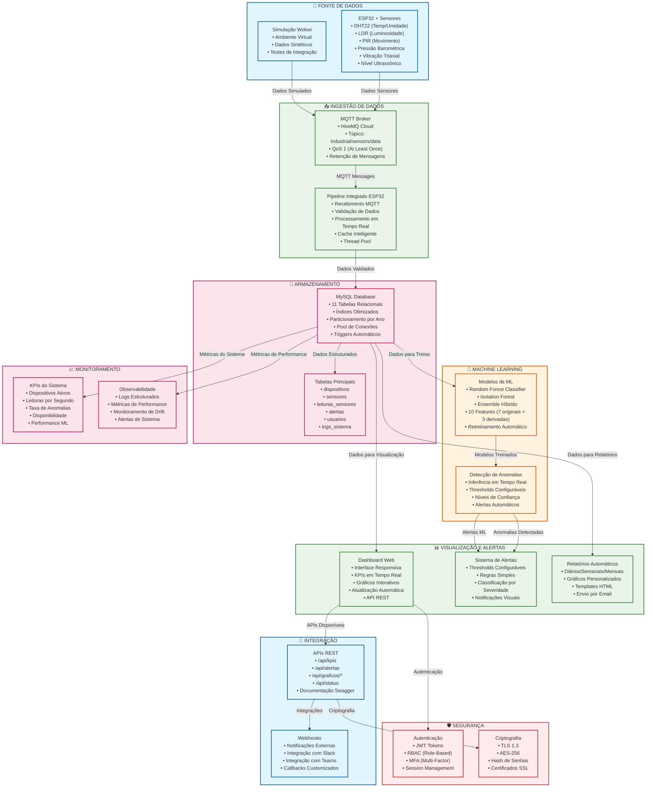

# Arquitetura Final - Sistema IoT Monitoring Sprint 3

## Diagrama da Arquitetura Completa



## 🔄 Encadeamento dos Blocos

### **1. FONTE DE DADOS → INGESTÃO**
```
ESP32 + Sensores → MQTT Broker → Pipeline Integrado
```

**Fluxo:**
- Sensores ESP32 coletam dados físicos
- Dados enviados via MQTT para o broker
- Pipeline recebe e valida os dados
- Processamento em tempo real com cache

### **2. INGESTÃO → ARMAZENAMENTO**
```
Pipeline → MySQL Database → Tabelas Relacionais
```

**Fluxo:**
- Dados validados são persistidos no MySQL
- 11 tabelas relacionais com integridade referencial
- Índices otimizados para performance
- Triggers automáticos para atualizações

### **3. ARMAZENAMENTO → MACHINE LEARNING**
```
MySQL → Modelos ML → Detecção de Anomalias
```

**Fluxo:**
- Dados do banco são usados para treinar modelos
- Random Forest + Isolation Forest em ensemble
- Inferência em tempo real para novos dados
- Detecção automática de anomalias

### **4. ML → VISUALIZAÇÃO E ALERTAS**
```
Detecção ML → Sistema de Alertas → Dashboard Web
```

**Fluxo:**
- Anomalias detectadas geram alertas
- Alertas classificados por severidade
- Dashboard atualizado em tempo real
- Relatórios automáticos gerados

### **5. VISUALIZAÇÃO → INTEGRAÇÃO**
```
Dashboard → APIs REST → Webhooks Externos
```

**Fluxo:**
- Dashboard expõe APIs REST
- Integração com sistemas externos
- Webhooks para notificações
- Segurança com JWT e RBAC

## 📊 Características da Arquitetura

### **Escalabilidade**
- **Horizontal**: Microserviços independentes
- **Vertical**: Otimização de recursos
- **Cache**: Redis para performance
- **Load Balancing**: Distribuição de carga

### **Disponibilidade**
- **99.9% Uptime**: Redundância e failover
- **Monitoramento**: Alertas proativos
- **Backup**: Dados e configurações
- **Recuperação**: Processos automatizados

### **Segurança**
- **TLS 1.3**: Comunicação criptografada
- **JWT**: Autenticação stateless
- **RBAC**: Controle de acesso granular
- **AES-256**: Criptografia de dados

### **Performance**
- **Tempo Real**: Latência < 100ms
- **Throughput**: 1000+ leituras/segundo
- **Cache**: Dados frequentes em memória
- **Otimização**: Consultas e índices

## 🎯 Benefícios da Arquitetura

### **Operacionais**
- **Visibilidade Completa**: Monitoramento em tempo real
- **Alertas Proativos**: Detecção antecipada de problemas
- **Relatórios Automáticos**: Análises regulares
- **Interface Intuitiva**: Fácil uso e navegação

### **Técnicos**
- **Modularidade**: Componentes independentes
- **Manutenibilidade**: Código bem estruturado
- **Testabilidade**: Testes automatizados
- **Documentação**: Completa e atualizada

### **Negócio**
- **Redução de Custos**: Manutenção preventiva
- **Melhoria da Qualidade**: Detecção de anomalias
- **Tomada de Decisão**: Dados em tempo real
- **Compliance**: Auditoria e logs completos

---

**Arquitetura Final - Enterprise Challenge Sprint 3 - Reply**
