# Arquitetura Integrada - Sistema IoT Monitoring (Mermaid)

## Diagrama da Arquitetura Completa

```mermaid
graph TB
    %% ORIGEM DE DADOS
    subgraph ORIGEM["🔌 ORIGEM DE DADOS"]
        ESP32["ESP32 Real<br/>• Sensores Físicos<br/>• DHT22, LDR, PIR<br/>• Pressão, Vibração, Nível<br/>• Formato: JSON<br/>• Frequência: 1Hz"]
        WOKWI["Simulação Wokwi<br/>• Ambiente Virtual<br/>• Dados Sintéticos<br/>• Testes de Integração<br/>• Formato: JSON<br/>• Frequência: 0.5Hz"]
    end
    
    %% TRANSPORTE
    subgraph TRANSPORTE["📡 TRANSPORTE DE DADOS"]
        MQTT["MQTT Broker<br/>• HiveMQ Cloud<br/>• Tópico: industrial/sensors/{id}/data<br/>• QoS: 1 (At Least Once)<br/>• Formato: JSON<br/>• Retenção: 24h"]
        HTTP["HTTP API<br/>• REST Endpoints<br/>• /api/sensors/data<br/>• Formato: JSON<br/>• Autenticação: JWT<br/>• Rate Limit: 1000/min"]
        SERIAL["Serial/USB<br/>• Comunicação Direta<br/>• Baud Rate: 115200<br/>• Formato: CSV<br/>• Frequência: 1Hz<br/>• Buffer: 1KB"]
    end
    
    %% ETL/ELT
    subgraph ETL["⚙️ ETL/ELT SIMPLES"]
        PIPELINE["Pipeline de Processamento<br/>• Validação de Dados<br/>• Enriquecimento<br/>• Transformação<br/>• Formato: JSON → JSON<br/>• Frequência: Tempo Real"]
        CACHE["Cache Inteligente<br/>• Redis/Memória<br/>• TTL: 5 minutos<br/>• Dispositivos Ativos<br/>• Dados Frequentes<br/>• Formato: JSON"]
        VALIDACAO["Validação de Dados<br/>• Estrutura JSON<br/>• Tipos de Dados<br/>• Ranges Válidos<br/>• Qualidade Mínima<br/>• Formato: JSON"]
    end
    
    %% BANCO RELACIONAL
    subgraph BANCO["💾 BANCO RELACIONAL"]
        MYSQL["MySQL Database<br/>• 11 Tabelas Normalizadas<br/>• Índices Otimizados<br/>• Particionamento por Ano<br/>• Pool de Conexões<br/>• Backup Automático"]
        TABELAS["Tabelas Principais<br/>• dispositivos<br/>• sensores<br/>• leituras_sensores<br/>• alertas<br/>• usuarios<br/>• logs_sistema<br/>• configuracao_sensores<br/>• tipos_alertas<br/>• regras_negocio<br/>• metricas_sistema<br/>• auditoria"]
    end
    
    %% MACHINE LEARNING
    subgraph ML["🤖 MACHINE LEARNING"]
        TREINAMENTO["Treinamento de Modelos<br/>• Random Forest<br/>• Isolation Forest<br/>• Ensemble Híbrido<br/>• Frequência: Diária<br/>• Dados: CSV/JSON<br/>• Features: 10 variáveis"]
        INFERENCIA["Inferência Tempo Real<br/>• Predição de Anomalias<br/>• Thresholds Configuráveis<br/>• Níveis de Confiança<br/>• Frequência: 1Hz<br/>• Formato: JSON"]
        DRIFT["Monitoramento Drift<br/>• Detecção de Mudanças<br/>• Retreinamento Automático<br/>• Frequência: Horária<br/>• Alertas de Degradação<br/>• Formato: JSON"]
    end
    
    %% VISUALIZAÇÃO E ALERTAS
    subgraph VISUALIZACAO["📊 VISUALIZAÇÃO E ALERTAS"]
        DASHBOARD["Dashboard Web<br/>• Interface Responsiva<br/>• KPIs em Tempo Real<br/>• Gráficos Interativos<br/>• Atualização: 30s<br/>• Formato: HTML/JSON"]
        ALERTAS["Sistema de Alertas<br/>• Thresholds Configuráveis<br/>• Regras Simples<br/>• Classificação Severidade<br/>• Frequência: Tempo Real<br/>• Formato: JSON/Email"]
        RELATORIOS["Relatórios Automáticos<br/>• Diários/Semanais/Mensais<br/>• Gráficos Personalizados<br/>• Templates HTML<br/>• Frequência: Agendada<br/>• Formato: PDF/HTML"]
    end
    
    %% APIs
    subgraph APIs["🔗 APIs REST"]
        ENDPOINTS["Endpoints<br/>• /api/kpis<br/>• /api/alertas<br/>• /api/graficos/*<br/>• /api/status<br/>• /api/sensors/*<br/>• Formato: JSON<br/>• Autenticação: JWT"]
        WEBHOOKS["Webhooks<br/>• Notificações Externas<br/>• Slack/Teams<br/>• Callbacks Customizados<br/>• Frequência: Tempo Real<br/>• Formato: JSON"]
        MONITORAMENTO["Monitoramento<br/>• Logs Estruturados<br/>• Métricas Performance<br/>• Health Checks<br/>• Frequência: Contínua<br/>• Formato: JSON"]
    end
    
    %% FLUXOS DE DADOS
    ESP32 -->|"JSON 1Hz"| MQTT
    WOKWI -->|"JSON 0.5Hz"| MQTT
    ESP32 -->|"CSV 1Hz"| SERIAL
    
    MQTT -->|"JSON Tempo Real"| PIPELINE
    HTTP -->|"JSON REST"| PIPELINE
    SERIAL -->|"CSV 1Hz"| PIPELINE
    
    PIPELINE -->|"JSON Cache"| CACHE
    PIPELINE -->|"JSON Validação"| VALIDACAO
    VALIDACAO -->|"SQL Batch"| MYSQL
    MYSQL -->|"SQL Dados"| TABELAS
    
    MYSQL -->|"CSV/JSON Diário"| TREINAMENTO
    TREINAMENTO -->|"Modelo Treinado"| INFERENCIA
    INFERENCIA -->|"JSON Tempo Real"| ALERTAS
    
    MYSQL -->|"JSON 30s"| DASHBOARD
    DASHBOARD -->|"JSON REST"| ENDPOINTS
    ENDPOINTS -->|"JSON Webhook"| WEBHOOKS
    
    INFERENCIA -->|"JSON Tempo Real"| ALERTAS
    MYSQL -->|"JSON 30s"| DASHBOARD
    
    %% ESTILOS
    classDef origem fill:#E1F5FE,stroke:#01579B,stroke-width:2px
    classDef transporte fill:#E8F5E8,stroke:#2E7D32,stroke-width:2px
    classDef etl fill:#FCE4EC,stroke:#C2185B,stroke-width:2px
    classDef banco fill:#E1F5FE,stroke:#01579B,stroke-width:2px
    classDef ml fill:#FFF3E0,stroke:#E65100,stroke-width:2px
    classDef visualizacao fill:#E8F5E8,stroke:#2E7D32,stroke-width:2px
    classDef apis fill:#E1F5FE,stroke:#01579B,stroke-width:2px
    
    class ORIGEM,ESP32,WOKWI origem
    class TRANSPORTE,MQTT,HTTP,SERIAL transporte
    class ETL,PIPELINE,CACHE,VALIDACAO etl
    class BANCO,MYSQL,TABELAS banco
    class ML,TREINAMENTO,INFERENCIA,DRIFT ml
    class VISUALIZACAO,DASHBOARD,ALERTAS,RELATORIOS visualizacao
    class APIs,ENDPOINTS,WEBHOOKS,MONITORAMENTO apis
```



## 🔄 Fluxos de Dados Detalhados

### **Fluxo Principal (Verde)**
```
ESP32 Real → MQTT → Pipeline → Validação → MySQL → ML → Alertas
```

### **Fluxo de Dados (Azul)**
```
MySQL → Dashboard → APIs → Webhooks
```

### **Fluxo de Segurança (Vermelho)**
```
ML → Detecção → Alertas → Notificações
```

## 📊 Formatos de Dados

### **JSON (Principal)**
- **Uso**: MQTT, APIs, ML, Dashboard
- **Estrutura**: Hierárquica
- **Vantagens**: Legível, flexível

### **CSV (Serial)**
- **Uso**: Comunicação serial
- **Estrutura**: Tabular
- **Vantagens**: Simples, compacto

### **SQL (Banco)**
- **Uso**: Persistência
- **Estrutura**: Relacional
- **Vantagens**: ACID, consultas complexas

### **HTML (Dashboard)**
- **Uso**: Interface web
- **Estrutura**: Markup
- **Vantagens**: Visual, interativo

## ⏰ Periodicidades

### **Coleta de Dados**
- **ESP32 Real**: 1Hz (1 vez por segundo)
- **Wokwi Simulação**: 0.5Hz (1 vez a cada 2 segundos)
- **Serial/USB**: 1Hz (1 vez por segundo)

### **Processamento**
- **Pipeline**: Tempo real (imediato)
- **Validação**: Tempo real (imediato)
- **Cache**: 5 minutos (TTL)

### **Armazenamento**
- **MySQL**: Batch (a cada 100 registros ou 1 minuto)
- **Backup**: Diário (00:00)
- **Limpeza**: Semanal (dados antigos)

### **Machine Learning**
- **Treinamento**: Diário (02:00)
- **Inferência**: Tempo real (1Hz)
- **Drift**: Horário (a cada hora)
- **Retreinamento**: Automático (quando necessário)

### **Visualização**
- **Dashboard**: 30 segundos
- **KPIs**: 30 segundos
- **Gráficos**: 30 segundos
- **Relatórios**: Agendados (diário/semanal/mensal)

### **Alertas**
- **Detecção**: Tempo real (imediato)
- **Notificações**: Tempo real (imediato)
- **Webhooks**: Tempo real (imediato)
- **Email**: Tempo real (imediato)

## 🔧 Tecnologias Utilizadas

### **Backend**
- **Python 3.8+**: Linguagem principal
- **Flask**: Framework web
- **MySQL**: Banco de dados
- **Redis**: Cache
- **MQTT**: Comunicação IoT

### **Machine Learning**
- **Scikit-learn**: Modelos ML
- **Pandas**: Processamento de dados
- **NumPy**: Computação numérica
- **Joblib**: Persistência de modelos

### **Frontend**
- **Bootstrap 5**: Framework CSS
- **Plotly**: Gráficos interativos
- **HTML5/CSS3/JavaScript**: Interface
- **AJAX**: Comunicação assíncrona

### **Infraestrutura**
- **Docker**: Containerização
- **Nginx**: Proxy reverso
- **HiveMQ**: Broker MQTT
- **Git**: Controle de versão

## 📈 Métricas de Performance

### **Throughput**
- **Dados Coletados**: 1000+ leituras/segundo
- **Processamento**: Tempo real (< 100ms)
- **Armazenamento**: 10.000+ registros/minuto
- **ML Inferência**: 1000+ predições/segundo

### **Latência**
- **Coleta → Processamento**: < 50ms
- **Processamento → Armazenamento**: < 100ms
- **Armazenamento → Dashboard**: < 200ms
- **ML Inferência**: < 50ms

### **Disponibilidade**
- **Sistema**: 99.9% uptime
- **Banco de Dados**: 99.95% uptime
- **MQTT Broker**: 99.9% uptime
- **APIs**: 99.9% uptime

---

**Arquitetura Integrada - Enterprise Challenge Sprint 3 - Reply**
