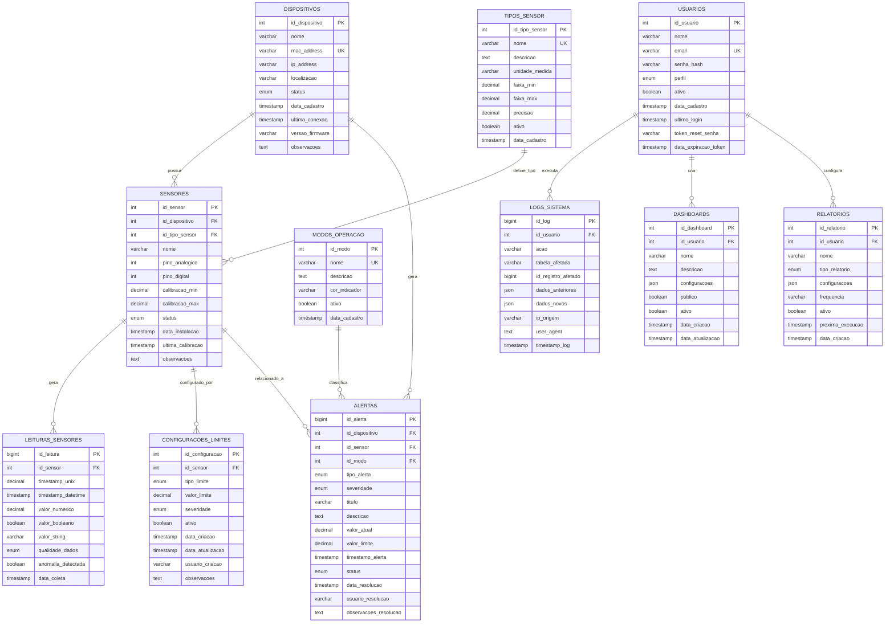

# Diagrama ER (Entidade-Relacionamento) - Sistema IoT

## Diagrama Mermaid

## Descrição das Entidades

### 1. DISPOSITIVOS
**Propósito**: Armazena informações dos dispositivos ESP32 conectados ao sistema.

**Campos Principais**:
- `id_dispositivo`: Chave primária única
- `nome`: Nome identificador do dispositivo
- `mac_address`: Endereço MAC único para identificação
- `ip_address`: Endereço IP atual do dispositivo
- `localizacao`: Local físico onde o dispositivo está instalado
- `status`: Estado atual (ativo, inativo, manutenção)
- `ultima_conexao`: Timestamp da última comunicação
- `versao_firmware`: Versão do firmware instalado

**Justificativa**: Centraliza informações de todos os dispositivos IoT, permitindo rastreamento e gerenciamento.

### 2. TIPOS_SENSOR
**Propósito**: Catálogo dos tipos de sensores disponíveis no sistema.

**Campos Principais**:
- `id_tipo_sensor`: Chave primária única
- `nome`: Nome do tipo de sensor (DHT22, LDR, PIR, etc.)
- `unidade_medida`: Unidade de medida específica
- `faixa_min/max`: Faixa de operação do sensor
- `precisao`: Precisão do sensor

**Justificativa**: Padroniza os tipos de sensores, facilitando configuração e manutenção.

### 3. SENSORES
**Propósito**: Representa sensores físicos instalados nos dispositivos.

**Campos Principais**:
- `id_sensor`: Chave primária única
- `id_dispositivo`: Referência ao dispositivo
- `id_tipo_sensor`: Referência ao tipo de sensor
- `pino_analogico/digital`: Configuração de hardware
- `calibracao_min/max`: Valores de calibração
- `status`: Estado operacional do sensor

**Justificativa**: Mapeia sensores físicos para configuração e monitoramento individual.

### 4. LEITURAS_SENSORES
**Propósito**: Armazena dados coletados pelos sensores (tabela principal).

**Campos Principais**:
- `id_leitura`: Chave primária única
- `id_sensor`: Referência ao sensor
- `timestamp_unix/datetime`: Timestamps da leitura
- `valor_numerico/booleano/string`: Valores lidos
- `qualidade_dados`: Classificação da qualidade
- `anomalia_detectada`: Flag de detecção de anomalia

**Justificativa**: Tabela central para armazenamento de dados históricos com particionamento por ano.

### 5. MODOS_OPERACAO
**Propósito**: Define estados de operação do sistema.

**Campos Principais**:
- `id_modo`: Chave primária única
- `nome`: Nome do modo (Normal, Alerta, Falha)
- `cor_indicador`: Cor para interface visual
- `descricao`: Descrição do modo

**Justificativa**: Padroniza estados do sistema para interface e alertas.

### 6. ALERTAS
**Propósito**: Sistema de alertas e notificações.

**Campos Principais**:
- `id_alerta`: Chave primária única
- `id_dispositivo/sensor`: Referências relacionadas
- `tipo_alerta`: Categoria do alerta
- `severidade`: Nível de criticidade
- `valor_atual/limite`: Valores que geraram o alerta
- `status`: Estado do alerta (ativo, resolvido, ignorado)

**Justificativa**: Gerencia notificações e permite rastreamento de resoluções.

### 7. CONFIGURACOES_LIMITES
**Propósito**: Configura limites para geração de alertas.

**Campos Principais**:
- `id_configuracao`: Chave primária única
- `id_sensor`: Referência ao sensor
- `tipo_limite`: Tipo (mínimo, máximo, variação)
- `valor_limite`: Valor limite configurado
- `severidade`: Nível de alerta

**Justificativa**: Permite configuração flexível de limites por sensor.

### 8. USUARIOS
**Propósito**: Gerencia usuários do sistema.

**Campos Principais**:
- `id_usuario`: Chave primária única
- `email`: Login único
- `perfil`: Nível de acesso (admin, operador, visualizador)
- `senha_hash`: Hash da senha
- `token_reset_senha`: Para recuperação de senha

**Justificativa**: Controla acesso e permissões no sistema.

### 9. LOGS_SISTEMA
**Propósito**: Auditoria de atividades do sistema.

**Campos Principais**:
- `id_log`: Chave primária única
- `id_usuario`: Usuário que executou a ação
- `acao`: Tipo de ação realizada
- `dados_anteriores/novos`: JSON com mudanças
- `ip_origem`: IP de origem da ação

**Justificativa**: Rastreabilidade e auditoria de mudanças.

### 10. DASHBOARDS
**Propósito**: Configurações de dashboards personalizados.

**Campos Principais**:
- `id_dashboard`: Chave primária única
- `id_usuario`: Proprietário do dashboard
- `configuracoes`: JSON com layout e widgets
- `publico`: Se é compartilhável

**Justificativa**: Permite personalização de interfaces por usuário.

### 11. RELATORIOS
**Propósito**: Configurações de relatórios automáticos.

**Campos Principais**:
- `id_relatorio`: Chave primária única
- `tipo_relatorio`: Frequência (diário, semanal, mensal)
- `frequencia`: Expressão cron
- `proxima_execucao`: Próxima execução agendada

**Justificativa**: Automação de geração de relatórios.

## Relacionamentos Principais

1. **DISPOSITIVOS → SENSORES**: Um dispositivo pode ter múltiplos sensores
2. **TIPOS_SENSOR → SENSORES**: Um tipo pode ser usado em múltiplos sensores
3. **SENSORES → LEITURAS_SENSORES**: Um sensor gera múltiplas leituras
4. **SENSORES → CONFIGURACOES_LIMITES**: Um sensor pode ter múltiplas configurações
5. **DISPOSITIVOS/SENSORES → ALERTAS**: Alertas podem ser gerados por dispositivos ou sensores específicos
6. **USUARIOS → LOGS_SISTEMA**: Usuários geram logs de suas ações
7. **USUARIOS → DASHBOARDS/RELATORIOS**: Usuários criam dashboards e relatórios personalizados

## Cardinalidades

- **1:N** - Dispositivo para Sensores
- **1:N** - Tipo de Sensor para Sensores  
- **1:N** - Sensor para Leituras
- **1:N** - Sensor para Configurações de Limites
- **1:N** - Dispositivo/Sensor para Alertas
- **1:N** - Usuário para Logs/Dashboards/Relatórios
- **N:1** - Leituras para Sensor
- **N:1** - Alertas para Dispositivo/Sensor/Modo
